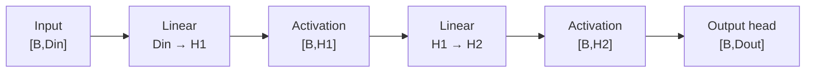
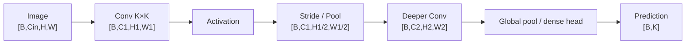
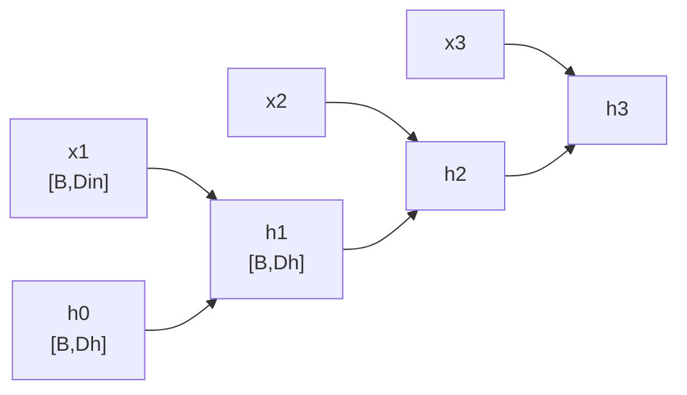
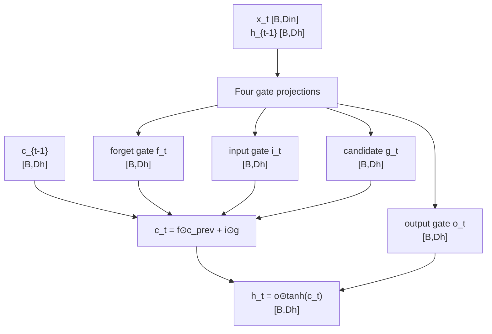
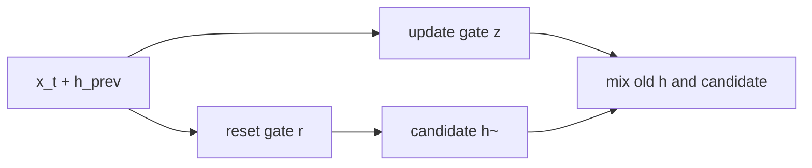
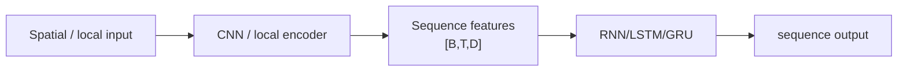

# Deep Learning Fundamentals — Architecture + Tensor Dimensions

> 只补本模块中真正属于“网络结构”的部分：MLP、CNN、RNN、LSTM。Loss、Optimizer、Normalization 等仍保留在原 README，不把它们伪装成独立模型。

# 1. MLP / Feed-Forward Network



### Shape

```text
X                         [B,Din]
W1                        [Din,H1]
h1                        [B,H1]
W2                        [H1,H2]
h2                        [B,H2]
output                    [B,Dout]
```

**核心创新/意义：** 多层 Linear 中加入非线性后才能表达复杂非线性函数；Transformer 的 FFN、projector、classification head 都可以看成 MLP 的变体。

---

# 2. CNN 公共骨架



### 卷积输出维度

```text
Hout = floor((H + 2P - K) / S) + 1
Wout = floor((W + 2P - K) / S) + 1

input                     [B,Cin,H,W]
kernel weights            [Cout,Cin,K,K]
output                    [B,Cout,Hout,Wout]
```

**核心意义：** locality + weight sharing 让 CNN 用少量参数高效学习局部 pattern；stride/downsampling 逐步扩大 receptive field。

---

# 3. Vanilla RNN



每步：

```text
x_t                      [B,Din]
h_{t-1}                  [B,Dh]

h_t = φ(x_t Wx + h_{t-1} Wh + b)

h_t                      [B,Dh]
```

整段序列：

```text
input                     [B,T,Din]
hidden sequence           [B,T,Dh]
final hidden              [B,Dh]
```

**核心意义：** hidden state 把过去信息递归传到当前时间步；缺点是时间步严格串行，长距离梯度路径很长。

---

# 4. LSTM



### Shape

实现里常一次性算四组 gate：

```text
concat/input projection   [B,4Dh]
→ split into
f, i, g, o               each [B,Dh]
cell state c_t            [B,Dh]
hidden state h_t          [B,Dh]
sequence output           [B,T,Dh]
```

**创新点：** cell state 提供更稳定的信息通路；forget/input/output gates 学会“忘什么、写什么、读什么”，缓解 vanilla RNN 的长依赖问题。

口诀：`RNN 只有 h；LSTM 多一条 c，并用三类 gate 管它。`

---

# 5. GRU（用于和 LSTM 对比）

若面试追问，可以记 GRU 更紧凑：

```text
update gate z_t           [B,Dh]
reset gate r_t            [B,Dh]
candidate h~_t            [B,Dh]
h_t                       [B,Dh]
```



**创新点：** 把 LSTM 的 cell/hidden 与部分 gates 合并，参数和状态更少，但仍保留门控长依赖能力。

---

# 6. CNN → RNN：经典视觉/序列组合

很多旧 OCR、video、time-series 架构都能画成：



例如 CRNN OCR 正是：

```text
image → CNN feature map → width sequence → BiLSTM → CTC
```

---

# 最终只记这些差异

| Model | State / representation | 关键 shape | 核心特点 |
|---|---|---|---|
| MLP | feature vector | `[B,D]` | fully connected nonlinear mapping |
| CNN | spatial feature map | `[B,C,H,W]` | locality + weight sharing |
| RNN | hidden state | `[B,T,Dh]` | recurrent sequence state |
| LSTM | hidden + cell | two `[B,Dh]` states | gated long-term memory |
| GRU | compact gated hidden | `[B,Dh]` | fewer gates/states than LSTM |

## 记忆口诀

```text
MLP：只改特征维
CNN：通道升、空间降
RNN：h 一步一步传
LSTM：h + c，门控决定留和忘
GRU：把 LSTM 做紧凑
```
