# Machine Learning Models — Structure, Input Dimensions & Innovation Logic

> 传统机器学习没有“层层 tensor backbone”这一统一结构，因此这里不强行画神经网络层，而是统一记录：**输入 shape → 决策结构 → 输出 shape → 相对前一类方法的核心创新**。

# 1. Linear Regression

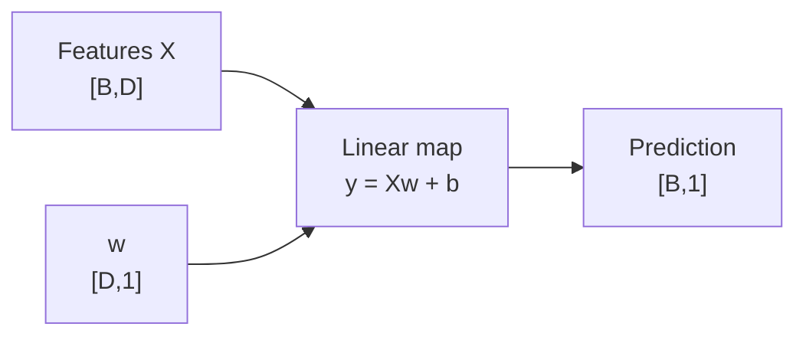

```text
X                         [B,D]
w                         [D,1]
y_hat                     [B,1]
```

**核心意义：** 最简单的连续预测 baseline；每个特征通过一个线性系数直接贡献到输出。

---

# 2. Logistic Regression

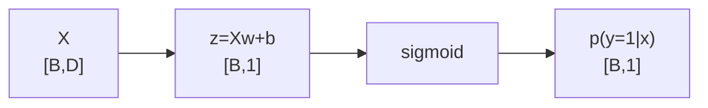

多分类 softmax 版本：

```text
W                         [D,K]
logits                    [B,K]
probabilities             [B,K]
```

**创新点相对线性回归：** 线性 score 后接概率 link function，把回归式线性组合变成分类概率模型。

---

# 3. KNN

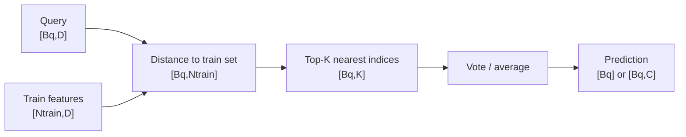

**结构特点：** 几乎没有参数训练；主要成本发生在 inference 的 neighbor search。高维时距离可区分性下降。

---

# 4. SVM

线性 SVM：

```text
X                         [B,D]
w                         [D]
score = Xw+b              [B]
```

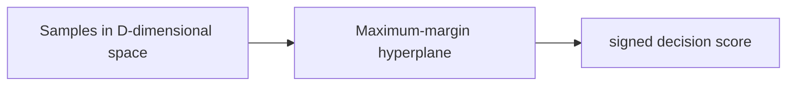

Kernel SVM：

```text
kernel matrix K           [B,B]
K_ij = K(x_i,x_j)
```

**创新点：** 不只要求分类正确，还最大化 decision boundary 到最近样本的 margin；kernel trick 可在不显式构造高维 `φ(x)` 的情况下得到非线性边界。

---

# 5. Decision Tree

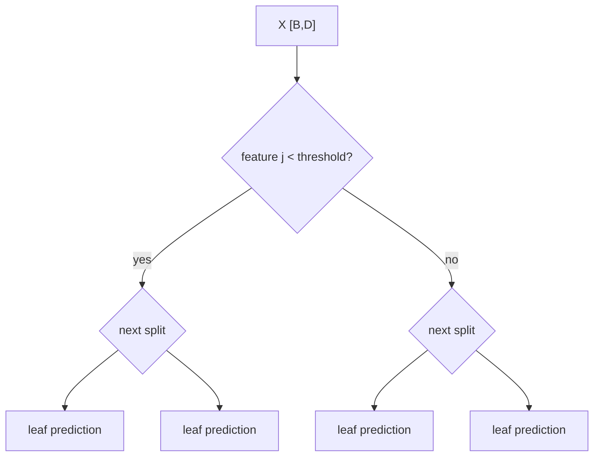

**结构特点：** 每个内部节点选择一个 feature + threshold；路径长度约等于 tree depth。天然表达非线性和 feature interaction。

---

# 6. Random Forest

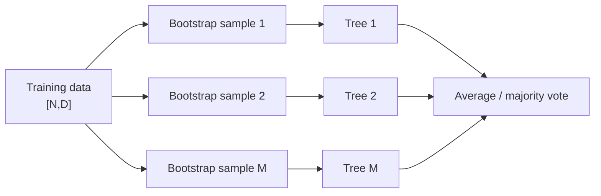

### 维度

```text
input                      [B,D]
M tree predictions         [B,M] regression
or                         [B,M,K] class probabilities
ensemble output            [B] / [B,K]
```

**创新点相对单树：** bootstrap + random feature subset 降低不同树之间相关性，再用 ensemble 降低 variance。

口诀：`树容易抖；森林让很多不完全一样的树投票。`

---

# 7. GBDT

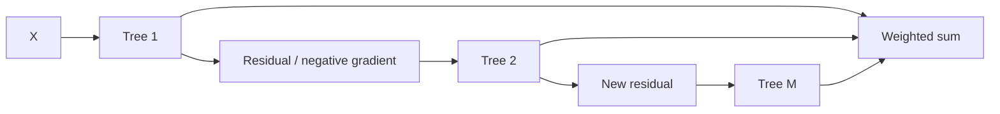

```text
F_m(x) = F_{m-1}(x) + η h_m(x)
```

**创新点相对 Random Forest：** 不是独立并行造树，而是串行地让下一棵树修正当前 ensemble 的错误。

口诀：`RF 并行投票；GBDT 串行纠错。`

---

# 8. XGBoost

整体 prediction shape 与 GBDT 相同：

```text
X                         [B,D]
M trees → scores          [B,M]
aggregate                 [B] / [B,K]
```

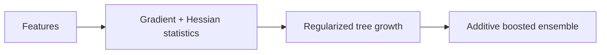

**创新点相对基础 GBDT：** 二阶 gradient/Hessian information、显式 regularization、column sampling、missing-value direction 和高效工程实现，使 boosting tree 成为 tabular 强 baseline。

---

# 9. K-Means

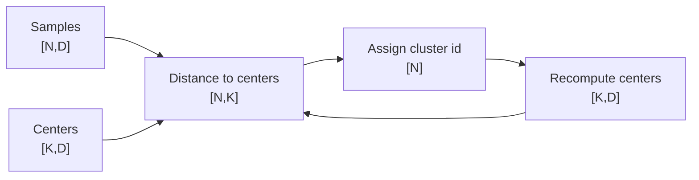

**创新/核心：** 交替做 assignment 和 centroid update，最小化样本到所属中心的平方距离。

---

# 10. DBSCAN

```text
input points               [N,D]
pair/local neighbor search neighborhood-dependent
output cluster id          [N]
noise label                [N]
```

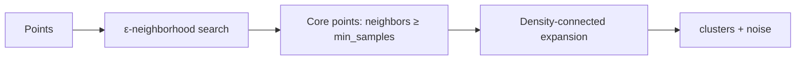

**创新点相对 K-Means：** cluster 由 density connectivity 定义，不要求球状 cluster，也不用提前指定 `K`，还能显式标 noise。

---

# 11. PCA

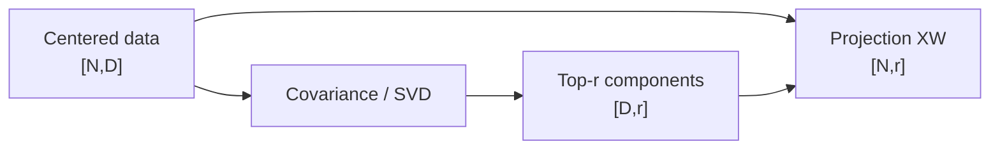

### Shape

```text
X                         [N,D]
principal directions      [D,r]
reduced representation    [N,r]
```

**核心意义：** 找到最大方差的正交方向，用线性投影压缩冗余维度；不是 nonlinear representation model。

---

# 12. t-SNE / UMAP：可视化映射而非监督预测模型

典型输入/输出：

```text
high-dimensional X        [N,D]
low-dimensional embedding [N,2] or [N,3]
```

**关键提醒：** 低维图“看起来分成几团”不能直接证明原高维数据天然存在稳定类别结构。

---

# 一张表记住传统模型

| Model | 输入 | 核心结构 | 输出 | 该记什么 |
|---|---|---|---|---|
| Linear Regression | `[B,D]` | one linear map | `[B,1]` | continuous linear baseline |
| Logistic Regression | `[B,D]` | linear + sigmoid/softmax | `[B,K]` | linear probability classifier |
| KNN | query + training set | nearest-neighbor search | labels/value | lazy learning |
| SVM | `[B,D]` | maximum-margin boundary | score/class | margin + kernel |
| Decision Tree | `[B,D]` | feature-threshold tree | leaf output | nonlinear rules |
| Random Forest | `[B,D]` | many independent trees | vote/mean | bagging lowers variance |
| GBDT | `[B,D]` | sequential residual trees | additive score | boosting |
| XGBoost | `[B,D]` | regularized second-order boosting | additive score | strong engineered GBDT |
| K-Means | `[N,D]` | K centers `[K,D]` | cluster ids | centroid iteration |
| DBSCAN | `[N,D]` | density connectivity | clusters/noise | arbitrary shapes + noise |
| PCA | `[N,D]` | projection `[D,r]` | `[N,r]` | linear variance-preserving compression |

## 面试记忆口诀

```text
线性回归：直接加权
逻辑回归：加权后过 sigmoid/softmax
KNN：问邻居
SVM：找最大间隔
Tree：一路问阈值
RF：并行很多树
GBDT：后一棵修前一棵
XGBoost：把 boosting 做得更强更工程化
K-Means：围着中心分组
DBSCAN：按密度连起来
PCA：找最大方差方向
```
