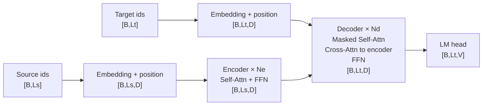
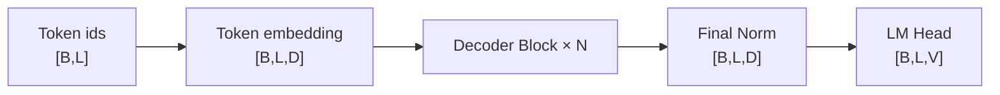
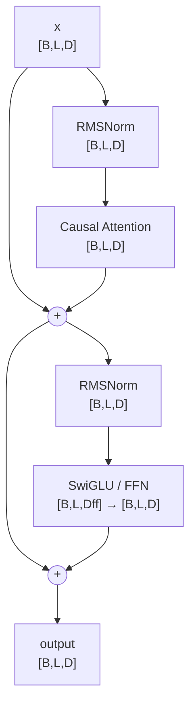
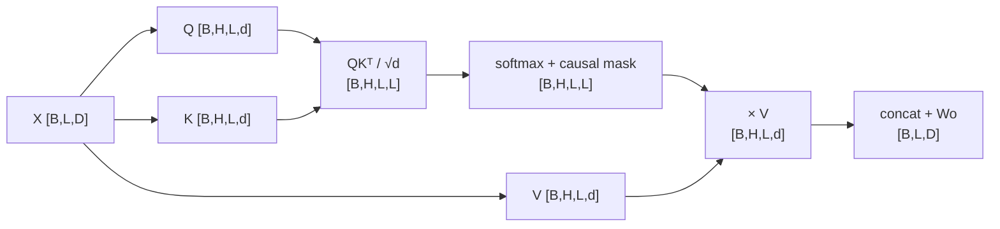
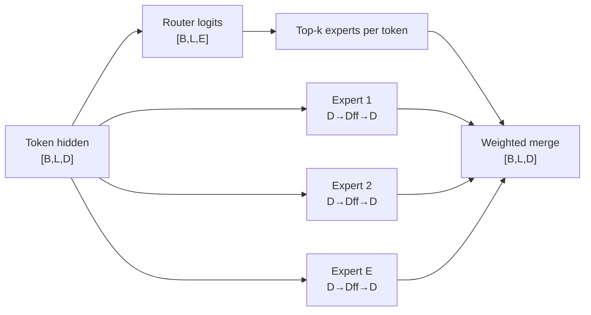

# Transformer / LLM Architecture & Tensor Dimensions

> 只补结构、shape 和架构创新；原有 Transformer 基础知识保持不变。

## 1. 原始 Encoder–Decoder Transformer



### 维度主线

```text
source ids                 [B,Ls]
source embedding           [B,Ls,D]
encoder memory             [B,Ls,D]
target hidden              [B,Lt,D]
logits                     [B,Lt,V]
```

**创新点：** attention 直接建立任意 token 间联系；encoder memory 与 autoregressive decoder 分工明确；训练阶段比 RNN 更易并行。

---

## 2. Decoder-only LLM：现代主干



### 一个 Pre-Norm Block



**要记的创新主线：** decoder-only 把 pretraining、prompt、code、tool call、multimodal token 都统一成 next-token prediction。

---

## 3. MHA：最标准的 attention shape

```text
X                         [B,L,D]
Q,K,V                     [B,L,D]
reshape                    [B,H,L,d]
where D = H × d
Q @ K^T                   [B,H,L,L]
softmax attention          [B,H,L,L]
attention @ V              [B,H,L,d]
concat heads               [B,L,D]
output projection          [B,L,D]
```



---

## 4. MHA → GQA → MQA：版本差异只记 KV heads

| Attention | Query heads | KV heads | KV-cache shape (per layer, conceptual) | 核心变化 |
|---|---:|---:|---|---|
| MHA | `Hq` | `Hq` | `[B,Hq,L,d]` for K and V | 每个 Q head 独立 K/V |
| GQA | `Hq` | `Hkv < Hq` | `[B,Hkv,L,d]` | 多个 Q heads 共享一组 K/V |
| MQA | `Hq` | `1` | `[B,1,L,d]` | 所有 Q heads 共享 K/V |

**记忆：** `Q 可以多，KV 可以少`。GQA/MQA 的主要收益是降低 decode 时 KV cache 带宽和显存。

---

## 5. KV Cache：为什么 decode 不重复算历史 token

### Prefill

```text
input hidden               [B,L,D]
K cache per layer          [B,Hkv,L,d]
V cache per layer          [B,Hkv,L,d]
```

### 单步 Decode

```text
new token hidden           [B,1,D]
new Q                      [B,Hq,1,d]
new K/V                    [B,Hkv,1,d]
append cache               [B,Hkv,L+1,d]
Q_new @ K_cache^T          [B,Hq,1,L+1]
```

**创新意义：** autoregressive inference 从“每步重算整个前缀”变成“历史 K/V 复用 + 新 token 增量计算”。

---

## 6. FFN → SwiGLU

### Classic FFN

```text
[B,L,D]
→ Linear
[B,L,Dff]
→ GELU
[B,L,Dff]
→ Linear
[B,L,D]
```

### SwiGLU

```text
u = xW1                  [B,L,Dff]
v = xW2                  [B,L,Dff]
SiLU(u) ⊙ v              [B,L,Dff]
× W3                     [B,L,D]
```

**创新点：** gate 分支提供更灵活的逐通道选择；现代 decoder-only LLM 中非常常见。

---

## 7. Dense FFN → Sparse MoE



### 维度

```text
router logits              [B,L,E]
top-k expert ids           [B,L,k]
selected expert output     [B,L,k,D]
weighted merge             [B,L,D]
```

**创新点：** 总参数量可以很大，但每个 token 只激活少数 experts，因此区分 **total parameters** 和 **active parameters**。

---

## 8. RoPE / M-RoPE：位置不改变 hidden shape

```text
Q,K before RoPE            [B,H,L,d]
Q,K after RoPE             [B,H,L,d]
```

RoPE 改的是 Q/K 中成对维度的旋转角度，不增加 sequence 或 hidden size。

多模态模型可进一步把 position 拆成：

```text
text:  1D position
image: (h,w)
video: (t,h,w)
```

这也是 Qwen-VL 系列 M-RoPE / interleaved multimodal position design 的核心背景。

---

## 面试只背这一张总图

```text
ids [B,L]
→ embedding [B,L,D]
→ N × {
     Norm
     Attention: [B,L,D] → Q/K/V → [B,H,L,d] → [B,L,D]
     Residual
     Norm
     FFN/SwiGLU or MoE: D → Dff → D
     Residual
  }
→ norm [B,L,D]
→ LM head [B,L,V]
```

### 版本差分口诀

```text
Transformer：先看 Encoder/Decoder
现代 LLM：Decoder-only
长上下文：看 position + attention
推理效率：看 KV heads / cache
模型扩容：看 Dense FFN 还是 MoE
```
