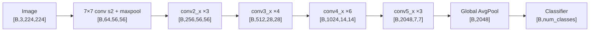
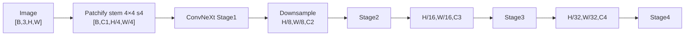
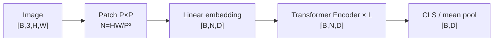
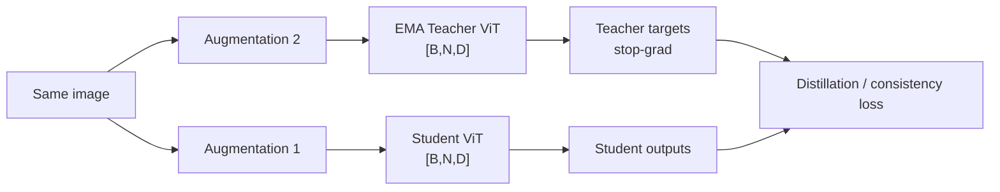
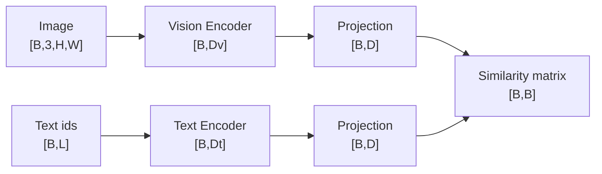

# Vision Backbones & Visual Pretraining — Architecture + Dimensions

> 原 README 的概念与解释不变；本页只补 **结构图、shape flow、模型创新点**。

## 1. ResNet-50：CNN 多尺度主干

### 结构图



### Bottleneck block

```text
x [B,C,H,W]
→ 1×1 conv: channel reduce
→ 3×3 conv: spatial modeling
→ 1×1 conv: channel expand
→ + identity / projection shortcut
→ output [B,Cout,H',W']
```

**创新点：** residual connection 让网络学习 `F(x)` 而不是完整 `H(x)`，显著改善超深网络优化；stage hierarchy 天然产生多尺度 feature maps。

---

## 2. ConvNeXt：把 Transformer 时代设计重新带回 CNN



### ConvNeXt block

```text
[B,C,H,W]
→ 7×7 depthwise conv
→ LayerNorm
→ 1×1 / Linear: C → 4C
→ GELU
→ 1×1 / Linear: 4C → C
→ residual
```

**创新点：** 大 kernel、depthwise conv、LayerNorm、inverted-bottleneck 风格，使纯 CNN 获得更接近现代 Transformer 的训练与扩展特性。

---

## 3. ViT：从 feature map 变成 patch tokens

若 patch size 为 `P`：

```text
Image                     [B,3,H,W]
Patchify                   [B,N,P²×3]
N = (H/P) × (W/P)
Linear projection          [B,N,D]
+ CLS token(optional)      [B,N+1,D]
Transformer Encoder × L    [B,N(+1),D]
CLS / mean pool            [B,D]
```

### 典型 ViT-B/16, 224×224

```text
224×224 / patch16
→ 14×14 = 196 patch tokens
→ +1 CLS = 197 tokens
→ hidden D = 768
```



**创新点：** 把图像直接表示为 token sequence，用 global self-attention 建模远距离 patch 关系，减少 CNN 固有局部结构偏置。

---

## 4. Swin Transformer：分层 ViT

```text
Image                     [B,3,H,W]
Patch partition 4×4       [B,H/4,W/4,C]
Stage 1                    [B,H/4,W/4,C]
Patch Merge                [B,H/8,W/8,2C]
Stage 2                    [B,H/8,W/8,2C]
Patch Merge                [B,H/16,W/16,4C]
Stage 3                    [B,H/16,W/16,4C]
Patch Merge                [B,H/32,W/32,8C]
Stage 4                    [B,H/32,W/32,8C]
```


**创新点：** local window 把 attention 复杂度从全局 `N²` 降到局部窗口；shifted windows 让跨窗口信息在相邻 block 中交流；层级输出适合 detection/segmentation。

---

## 5. MAE：只让 Encoder 看可见 patches


**创新点：** encoder 只处理 `Nvis << N`，高 mask ratio 同时提高预训练难度并降低 encoder 计算；decoder 只在 pretraining 使用。

---

## 6. DINO / DINOv2：Teacher–Student Self-Distillation



**创新点：** 不依赖文本标签，通过 teacher-student 一致性学习强视觉表征；DINOv2 强调大规模高质量数据与稳定自监督训练，patch features 对 dense correspondence/segmentation 很有价值。

---

## 7. CLIP：双塔图文对齐



```text
image embeddings           [B,D]
text embeddings            [B,D]
normalized similarity      [B,B]
```

**创新点：** web-scale image-text contrastive learning 得到开放语义空间，zero-shot classification/retrieval 可以直接通过文本 prompt 工作。

---

## 8. SigLIP：CLIP 的 loss 变化，不是把 backbone 全推翻

### 公共骨架

```text
image encoder → image embedding [B,D]
text encoder  → text embedding  [B,D]
```

### 差异

```text
CLIP:   batch-level softmax contrastive objective
SigLIP: pairwise sigmoid objective on image-text pairs
```

**创新点：** 不要求所有 pair 放进一个全局 softmax，对大规模分布式训练的 batch/global-normalization 依赖更低。

---

## 9. SigLIP2：从 global alignment 进一步补 dense/localization 能力

```text
Image
→ vision transformer
→ dense patch features     [B,N,D]
→ global pooled embedding  [B,D]
```

**创新点速记：** `SigLIP = language-aligned global representation`；`SigLIP2 = 继续强化 dense features / localization / multi-resolution / multilingual`。具体 checkpoint 的 `N,D` 随输入和 backbone 变化，不应死背一个数字。

---

## 10. 一张表记住 vision backbone 差异

| Model | Internal representation | Resolution change | Global interaction | 面试创新点 |
|---|---|---|---|---|
| ResNet | `[B,C,H,W]` | stage downsample | convolution receptive field | residual learning |
| ConvNeXt | `[B,C,H,W]` | stage downsample | large-kernel conv | modernized CNN |
| ViT | `[B,N,D]` | usually fixed patch grid | global attention | image as tokens |
| Swin | hierarchical `[B,H,W,C]` | patch merge | window + shifted window | scalable dense vision |
| MAE | visible tokens only | unchanged grid semantics | ViT encoder | masked reconstruction |
| DINOv2 | dense ViT tokens | model-dependent | ViT | self-distilled dense representation |
| CLIP | global embeddings `[B,D]` | encoder-dependent | encoder-dependent | image-text contrastive alignment |
| SigLIP | global/dense embeddings | encoder-dependent | encoder-dependent | sigmoid pairwise objective |

## 版本记忆口诀

```text
ResNet：残差
ConvNeXt：现代 CNN 化
ViT：patch → token
Swin：window + hierarchy
MAE：遮住再重建
DINO：纯视觉自蒸馏
CLIP：图文对比
SigLIP：softmax 对比 → sigmoid pair loss
```
