# Detection / Segmentation / Grounding — Architecture, Dimensions & Innovation Deltas

> 与本目录 01–30 的原知识点配套。本页只解决三个问题：**怎么画、shape 怎么走、版本到底改了什么。**

## 0. 统一输入与多尺度速记

以 `640×640` detector 输入为例：

```text
P3 / stride 8     → 80×80
P4 / stride 16    → 40×40
P5 / stride 32    → 20×20
```

通道数随模型 size/backbone 改变，因此优先背：

```text
[B,C3,80,80]
[B,C4,40,40]
[B,C5,20,20]
```

---

# Part A. YOLO family

## 1. YOLO 公共骨架：只背这一张

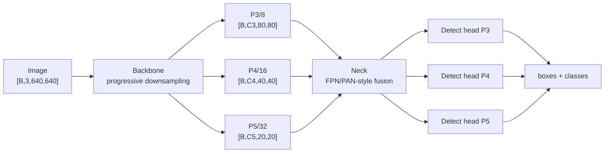

### Anchor-free dense head 的概念 shape

```text
P3 head                  [B,no,80,80]
P4 head                  [B,no,40,40]
P5 head                  [B,no,20,20]
flatten total locations  80² + 40² + 20² = 8400
```

其中 `no` 取决于具体版本的 box regression 表示与类别数。

---

## 2. YOLOv8

```text
Backbone: Conv/C2f + SPPF
Neck:     PAN/FPN-style multi-scale fusion
Head:     decoupled anchor-free detect head
```

Ultralytics detection head 常见 box branch 使用 DFL：

```text
box distribution channels = 4 × reg_max
reg_max commonly = 16
→ 64 box-distribution channels / location
class branch → nc channels / location
```

**创新点速记：** `C2f + anchor-free + decoupled head + DFL`，兼顾训练稳定性、精度与统一多任务生态。

---

## 3. YOLOv9

### 公共 shape 不变

```text
image → multi-scale backbone/neck → P3/P4/P5 → detection outputs
```

### 真正要记的变化

```text
GELAN = efficient aggregation architecture
PGI   = Programmable Gradient Information
```

**创新点：** YOLOv9 的重点不是“换一个输出 shape”，而是通过 GELAN 改善网络信息聚合，并用 PGI 改善深层网络训练时梯度/信息保留。面试时重点讲**训练信息路径**，而不是只背 layer 名。

---

## 4. YOLOv10

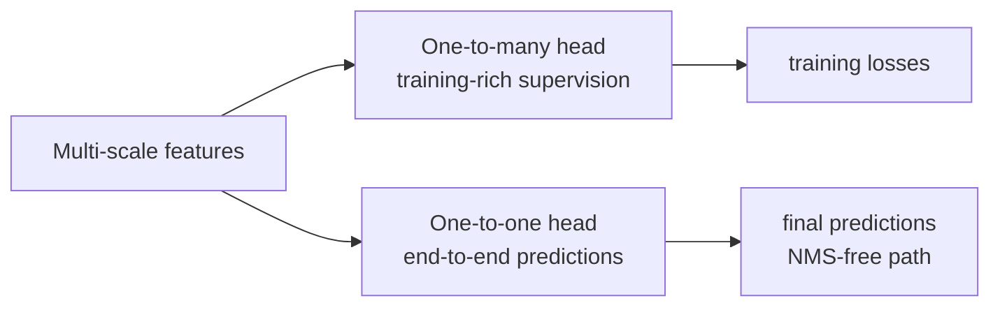

**创新点：** consistent dual assignment / dual-head 思路，使训练保留 dense one-to-many supervision，同时 one-to-one branch 学直接输出最终目标，推动 YOLO 进入 end-to-end NMS-free 路线。

---

## 5. YOLO11

公共主线仍是：

```text
Backbone → multi-scale neck → decoupled detect heads
```

与 YOLOv8 相比，重点应记作**模块效率与特征提取/融合的迭代**，而不是认为输出空间定义发生根本变化。检测仍使用 P3/P4/P5 多尺度预测；不同 n/s/m/l/x 的通道数、depth multiplier 不同。

**面试记忆：** `v8 是成熟 anchor-free baseline；11 是 Ultralytics 对 backbone/neck/head efficiency 的继续迭代。`

---

## 6. YOLO26

### 核心 head 差异

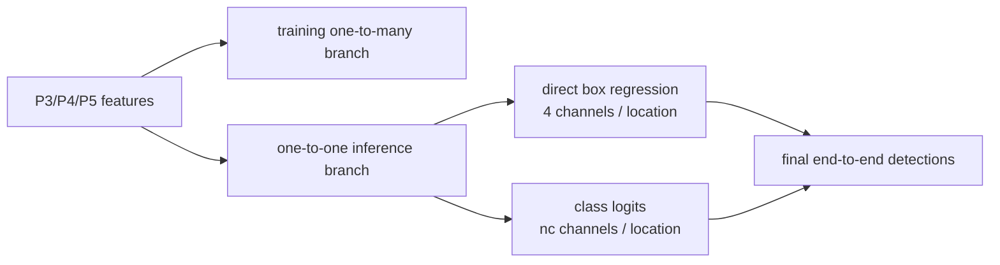

### 维度差异

```text
YOLOv8 / YOLO11 box branch:
4 × reg_max, commonly reg_max=16
→ DFL integral

YOLO26:
reg_max = 1
→ direct 4-coordinate regression
→ DFL becomes unnecessary
```

### 重点创新

- **end-to-end NMS-free** 为默认推理路径；
- **DFL-free** regression，head 更轻、export 更简单；
- dual-head training / one-to-one inference；
- Progressive Loss + STAL 改善训练与小目标正样本覆盖；
- task-specific segmentation / pose / OBB head 继续统一到同一 family。

**一句话：** `YOLO26 = 把 YOLOv10 的 end-to-end 思路进一步做成默认部署路径，并把 DFL 从 head 中移除。`

---

## 7. YOLOv8 → v9 → v10 → 11 → 26：只背差分

| Version | 公共骨架 | 真正该记的创新 |
|---|---|---|
| YOLOv8 | Backbone + PAN/FPN + multi-scale head | C2f、anchor-free、decoupled head、DFL |
| YOLOv9 | 同样是多尺度 detector | PGI + GELAN，重点在训练信息与高效聚合 |
| YOLOv10 | multi-scale + dual assignment/head | one-to-many training + one-to-one end-to-end inference，NMS-free |
| YOLO11 | Ultralytics multi-scale family | 模块/效率继续优化，输出范式与 v8 相近 |
| YOLO26 | multi-scale + end-to-end dual-head | 默认 NMS-free + DFL-free + training/deployment simplification |

口诀：

```text
8：C2f + DFL
9：PGI + GELAN
10：双分配，开始端到端
11：结构效率迭代
26：NMS-free + DFL-free 真正部署化
```

---

## 8. YOLO-World / YOLOE：closed-set → open-vocabulary

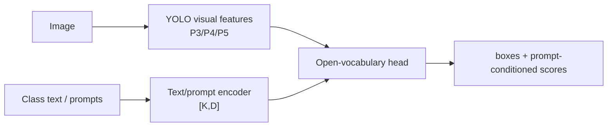

**创新点：** class classifier 不再只绑定训练时固定 `nc` 类别，而是让 visual features 与 text/prompt embedding 对齐；YOLOE 进一步扩展 promptable/open-vocabulary 实时感知。

---

# Part B. DETR family

## 9. DETR

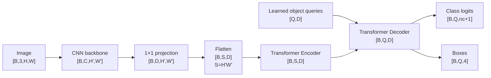

**创新点：** detection 被写成 set prediction；Hungarian matching 做一对一标签分配；固定数量 object queries 直接输出 objects，从结构上去掉 anchor 和传统 NMS 依赖。

---

## 10. Deformable DETR

```text
multi-scale features:
[B,C1,H1,W1], [B,C2,H2,W2], ...
→ project to D
→ flatten/concat
[B,S_total,D]
```

与 DETR 全局 cross-attention 不同，deformable attention 对每个 query/head/scale 只采样少数参考点：

```text
query                 [B,Q,D]
reference points      [B,Q,L,2 or 4]
sampled K points      sparse subset of feature maps
```

**创新点：** 稀疏采样显著降低高分辨率 attention 成本，并改善 DETR 收敛速度和小目标能力。

---

## 11. DINO detector

公共骨架：

```text
multi-scale encoder
→ query initialization
→ deformable decoder
→ [B,Q,D]
→ class + box heads
```

**重点创新：**
- contrastive denoising training；
- improved query initialization / mixed query selection；
- iterative box refinement。

口诀：`DINO = Deformable DETR 骨架 + 更强 query/denoising training。`

---

## 12. RT-DETR

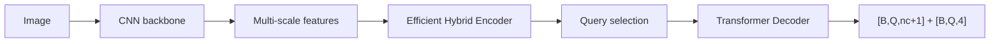

**创新点：** 针对 real-time 场景重新设计 multi-scale encoder 与 query selection，在保持 DETR end-to-end set prediction 的同时降低 latency；速度可通过 decoder layers 调节。

---

# Part C. SAM family

## 13. SAM

以标准 1024 输入、ViT patch16 为面试典型例：

```text
image                     [B,3,1024,1024]
patch16 grid              64×64
ViT image encoder         [B,64×64,Dv]
neck                      [B,256,64,64]
```

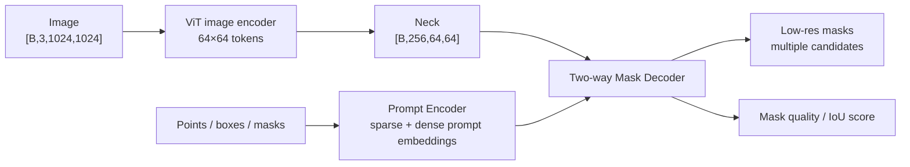

**创新点：** 把 segmentation 统一成 promptable interface；image embedding 可缓存，换 point/box prompt 时不必重跑整张图 encoder；data engine 支撑大规模 promptable mask 数据。

---

## 14. SAM2

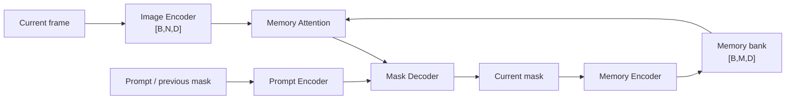

**创新点：** SAM 从静态 image prompting 扩展为 image + video 的统一 segmentation；streaming memory 让历史 object information 参与当前帧预测，并把新结果写回 memory。

---

# Part D. Grounding

## 15. GroundingDINO

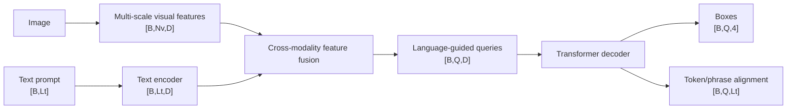

**创新点：** 把 DETR/DINO 风格 object queries 与 language grounding 结合，使输出不是固定 class id，而是 `phrase ↔ box` alignment。

---

## 16. GroundingDINO 1.5 / DINO-X

公共 shape 仍然是：

```text
visual tokens + text/prompt tokens
→ cross-modal representation
→ object queries
→ boxes + semantic alignment
```

面试应记**能力与数据/规模升级**，不要把未公开细节硬编成固定 hidden size。DINO-X 进一步朝 generalized/open-world perception foundation model 扩展。

---

## 17. Grounded SAM / Grounded SAM2

这不是一个单独端到端 backbone，而是模块化 perception toolchain：

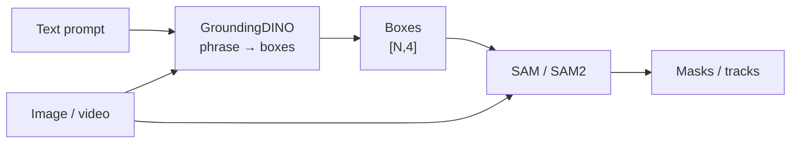

**创新意义：** detector/grounder 与 promptable segmenter 解耦，适合自动标注、机器人、GUI、video annotation。

---

# Part E. Segmentation models

## 18. U-Net

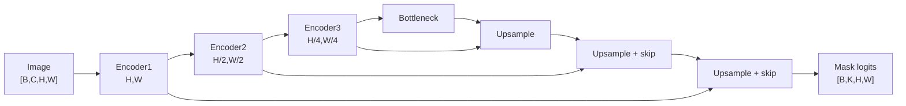

**创新点：** symmetric encoder-decoder + same-scale skip connections，兼顾 global context 与 pixel-level localization。

---

## 19. DeepLab

```text
image → CNN backbone
→ low-resolution semantic feature
→ ASPP / atrous conv at multiple dilation rates
→ decoder / upsample
→ logits [B,K,H,W]
```

**创新点：** atrous/dilated convolution 在不继续降低 spatial resolution 的情况下扩大 receptive field；ASPP 并行多 dilation rate 建模多尺度上下文。

---

## 20. Mask R-CNN

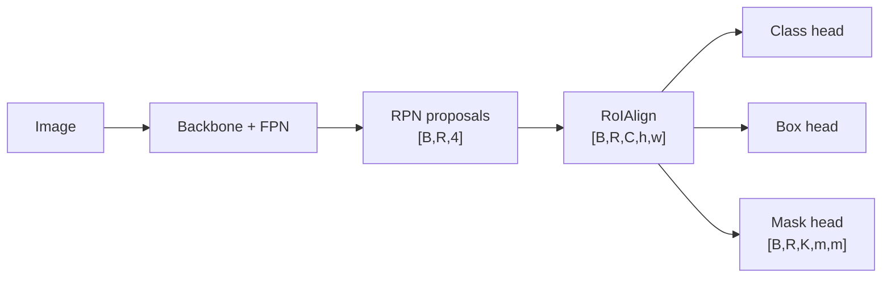

**创新点：** Faster R-CNN 两阶段 detector 上增加平行 mask branch；RoIAlign 避免量化对齐误差，使 instance-level mask localization 更精确。

---

## 21. Mask2Former

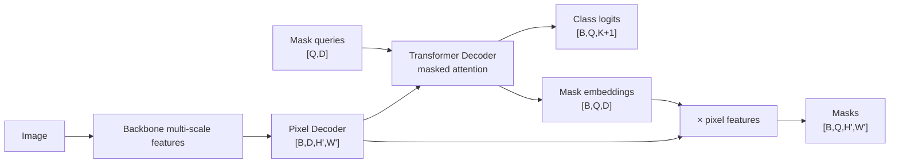

**创新点：** 用统一 query-based mask classification 范式覆盖 semantic/instance/panoptic segmentation；masked attention 只关注预测 mask 区域，提高优化与效率。

---

# 最终面试总口诀

```text
YOLO：dense multi-scale → 看版本 head/training 差异
DETR：queries → set prediction
SAM：image embedding + prompt → mask
SAM2：SAM + streaming memory
GroundingDINO：text + image → phrase-box
U-Net：encoder-decoder + skip
DeepLab：dilated conv + ASPP
Mask R-CNN：proposal + RoIAlign + mask branch
Mask2Former：mask queries + pixel decoder
```

## Primary references

- YOLO26: https://docs.ultralytics.com/models/yolo26/
- DETR: https://arxiv.org/abs/2005.12872
- Deformable DETR: https://arxiv.org/abs/2010.04159
- DINO: https://arxiv.org/abs/2203.03605
- RT-DETR: https://arxiv.org/abs/2304.08069
- SAM: https://arxiv.org/abs/2304.02643
- SAM2: https://arxiv.org/abs/2408.00714
- GroundingDINO: https://arxiv.org/abs/2303.05499
- U-Net: https://arxiv.org/abs/1505.04597
- DeepLabv3+: https://arxiv.org/abs/1802.02611
- Mask R-CNN: https://arxiv.org/abs/1703.06870
- Mask2Former: https://arxiv.org/abs/2112.01527
