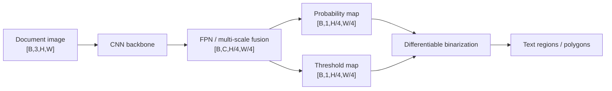
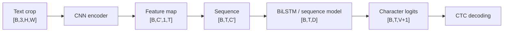
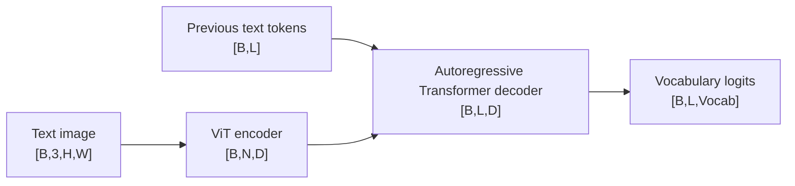
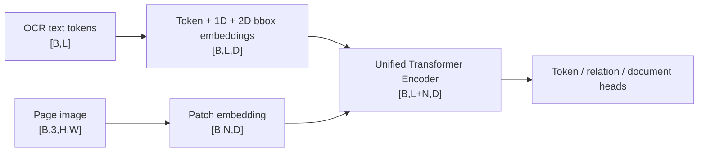
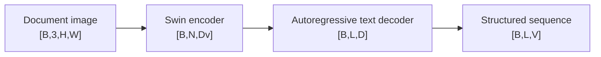
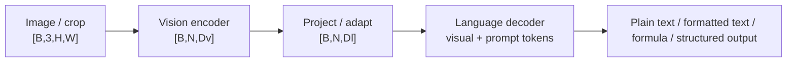
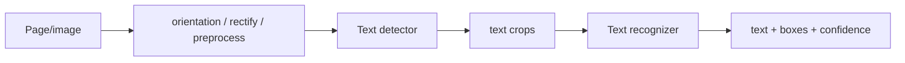
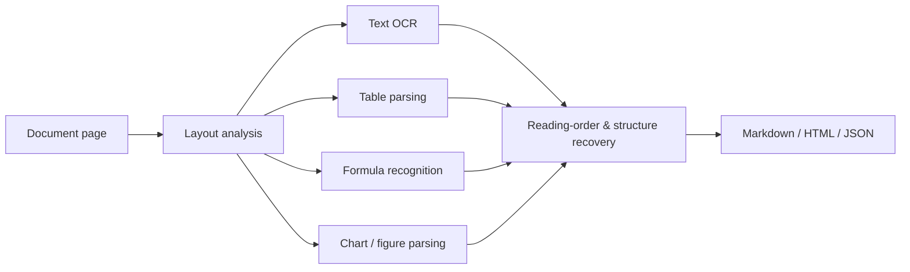
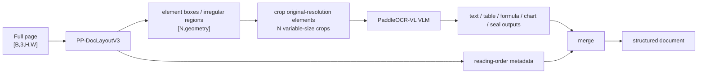
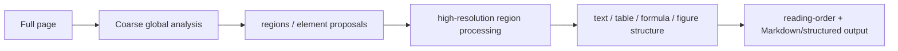

# OCR / Document AI — Architecture, Dimensions & Innovation Deltas

> 与本目录 01–15 配套。只补结构、shape 与模型创新，不改原有解释。

# Part A. Classical OCR

## 1. DBNet：Text Detection



**创新点：** 把传统不可微的二值化阈值过程做成可学习 differentiable binarization，使 segmentation-style text detector 可以端到端优化。

---

## 2. CRNN + CTC



**创新点：** CNN 负责空间视觉特征，RNN 负责横向序列依赖，CTC 允许在没有字符级 frame alignment 的情况下训练。

口诀：`图像压成一行 → 一行变序列 → CTC 去 blank/重复。`

---

# Part B. Transformer OCR

## 3. TrOCR



**创新点：** 直接把 OCR 写成 image-to-text Transformer encoder-decoder，减少经典 OCR 中独立字符切分、手工序列模块的依赖。

---

## 4. PARSeq

```text
image
→ visual encoder             [B,N,D]
→ permutation-aware decoder  [B,L,D]
→ character logits           [B,L,V]
```

**创新点：** permutation language modeling 让训练覆盖不同 autoregressive factorization/order，提升 scene-text recognition 的上下文建模与并行/自回归灵活性。

---

# Part C. Document multimodal encoders

## 5. LayoutLMv3



### 关键 shape

```text
text tokens                [B,L,D]
image patch tokens         [B,N,D]
concatenated sequence      [B,L+N,D]
```

**创新点：** 在同一 Transformer 中联合建模 text、2D layout 和 image patches，并配合 text-image alignment / masked objectives 学文档结构。

---

## 6. Donut：OCR-free document understanding



输出可以直接是 task-specific structured text，例如 JSON-like sequence。

**创新点：** 不依赖外部 OCR tokens/bboxes，直接从 page image 生成结构化文本，避免 OCR error 作为硬瓶颈传递到下游。

---

# Part D. Unified / modern OCR models

## 7. GOT-OCR2.0



**创新点：** 把 plain OCR、formatted OCR、region OCR 等任务统一为 prompt-driven vision-language generation；重点从单纯字符识别升级到统一 OCR interface。

具体 `N,Dv,Dl` 随公开 checkpoint/config 变化，不应把一个 checkpoint 的 hidden size 当成 GOT-OCR2.0 家族固定值。

---

## 8. PaddleOCR 3.x：PP-OCRv6

PP-OCR 是 **pipeline family**，不要误画成一个单一 Transformer：



### 典型 tensor interface

```text
page image                 [B,3,H,W]
detection map              [B,1,H',W']
N detected crops           list of [3,h_i,w_i]
recognizer sequence        [N,T,D]
character logits           [N,T,V]
```

**创新点：** 现代 PaddleOCR 强调 detector/recognizer/preprocess 的全 pipeline 工程优化、多语言和部署，而不是只靠一个 backbone 名字。

---

## 9. PP-StructureV3



**创新点：** 从 OCR 升级为 page-level structure recovery；不同 element type 使用专门处理路径，最终恢复 reading order 和可供 LLM/RAG 使用的结构化输出。

---

## 10. PaddleOCR-VL-1.6

仓库现有内容已经明确它是两阶段 document parsing pipeline。结构应这样画，而不是“整页 → 一个 LLM”：



### 维度重点

```text
full page                  [B,3,H,W]
layout regions             variable N × geometry
cropped regions            { [3,h_i,w_i] } for i=1..N
VLM visual tokens          [N,N_i,D]   (variable by crop/resolution)
output sequence            [N,L_i,V]
```

**创新点：** `layout first → original-resolution crop → VLM recognition → reading-order merge`，把高分辨率计算集中到信息区域；当前公开路线使用紧凑约 0.9B 级 VLM，但不要从参数规模反推未公开内部 layer shape。

---

## 11. MinerU2.5 / MinerU2.5-Pro

这也是 **coarse-to-fine document system**，应画成分阶段计算：



### Shape 逻辑

```text
coarse page representation       low-token global view
region set                       N regions
high-res region tensors          variable [3,h_i,w_i]
region outputs                   variable-length sequences/structures
page merge                       one ordered document representation
```

**创新点：** 不对所有页面区域都使用最高分辨率；先粗定位，再把高分辨率计算预算分配到需要精细解析的区域。

---

# Part E. 一张表记住 OCR / Document AI 差异

| Model / family | 输入主表示 | 中间表示 | 输出 | 最重要创新 |
|---|---|---|---|---|
| DBNet | image | segmentation maps | text polygons | differentiable binarization |
| CRNN | text crop | `[B,T,D]` | CTC chars | CNN + sequence + CTC |
| TrOCR | image patches | `[B,N,D]` | autoregressive text | image-to-text Transformer |
| PARSeq | image features | sequence decoder | chars | permutation language modeling |
| LayoutLMv3 | OCR tokens + page patches | `[B,L+N,D]` | document labels/relations | text-layout-image unified encoder |
| Donut | page image | visual tokens | structured text | OCR-free parsing |
| GOT-OCR2.0 | image + prompt | VLM tokens | unified OCR output | task unification via VLM |
| PP-OCRv6 | page → detector → crops | region sequences | text + boxes | engineered OCR pipeline |
| PP-StructureV3 | page + layout regions | element-specific branches | structured page | layout + multi-element recovery |
| PaddleOCR-VL-1.6 | page → regions | variable visual tokens | rich element content | layout-first high-res VLM recognition |
| MinerU2.5/Pro | coarse page → high-res regions | coarse-to-fine features | Markdown/structure | adaptive high-res document parsing |

## 面试口诀

```text
DBNet：先找字
CRNN：图压成序列
TrOCR：ViT 编码、文本解码
LayoutLMv3：文本 + bbox + 图像一起编码
Donut：不要 OCR，直接 page→text
现代 Document AI：先 layout，再按元素精读，最后恢复结构
```
