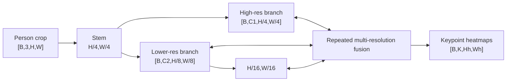
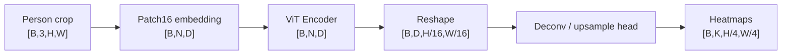
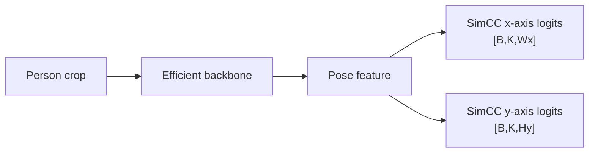
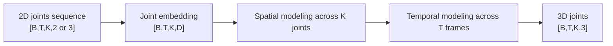
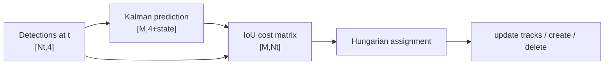
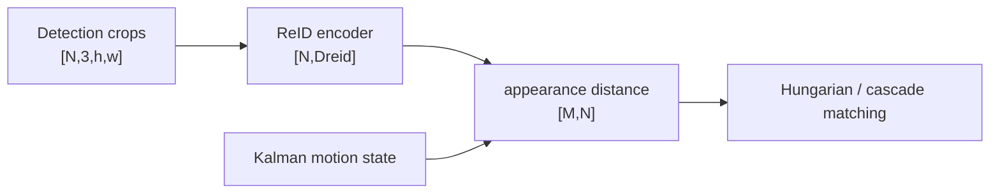
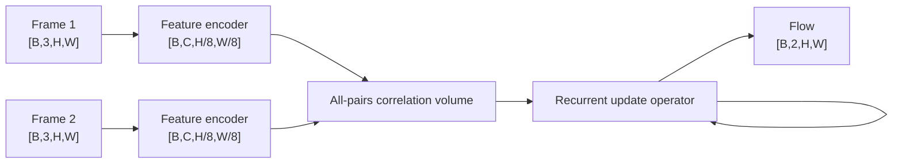
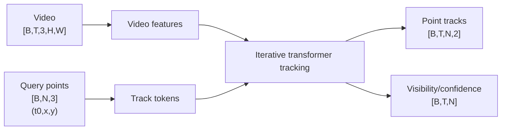
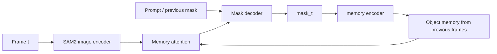
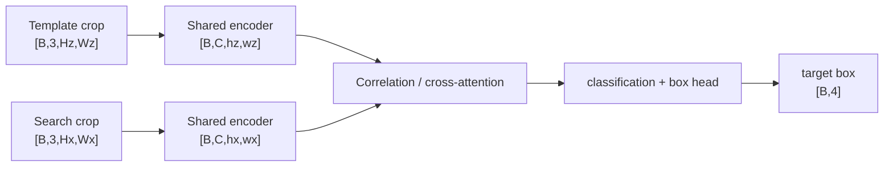

# Pose / Tracking / Motion — Architecture, Dimensions & Innovation Deltas

> 本页只补模型结构、tensor shape 与模型/算法家族的关键差异。Tracking 中 SORT/ByteTrack 等本质是系统算法，不强行伪装成神经网络。

# Part A. Pose Estimation

## 1. HRNet



**创新点：** 不像传统 CNN 一路降采样后再恢复，HRNet 全程保留高分辨率 branch，并持续和低分辨率语义 branch 交换信息，因此非常适合精确 localization。

---

## 2. ViTPose



### 维度

```text
N = (H/16) × (W/16)
ViT tokens                [B,N,D]
spatial feature           [B,D,H/16,W/16]
keypoint heatmaps         [B,K,H/4,W/4]  (typical head pattern)
```

**创新点：** 证明简单 ViT backbone + lightweight pose head 就能做强 pose estimation；重点不是复杂专用 backbone，而是大规模 visual representation 与 pose-specific decoding。

---

## 3. RTMPose：SimCC 输出不是 2D heatmap



### 与 heatmap 的差别

```text
Heatmap head:
[B,K,Hh,Wh]

SimCC:
x distribution             [B,K,Wx]
y distribution             [B,K,Hy]
```

**创新点：** 把 2D keypoint localization 拆成两个 1D classification problems，避免高分辨率 2D heatmap 的大显存/计算开销，同时保持亚像素级精度。

---

## 4. RTMO / RTMW

### RTMO：one-stage multi-person pose

```text
image
→ detector-style backbone/neck
→ person instance assignment
→ keypoint prediction
→ [B,Nperson,K,2] + confidence
```

**创新点：** 不再严格依赖 `person detector → crop → pose model` 的 top-down 两阶段路径，强调 end-to-end / one-stage multi-person pose efficiency。

### RTMW

`RTMW` 更强调 whole-body keypoints。输出可抽象为：

```text
[B,Nperson,Kwholebody,2] + score
```

`K` 显著多于只做 body joints 的模型。

---

## 5. MotionBERT：2D pose → 3D pose



**创新点：** 把 skeleton sequence 当作 structured spatio-temporal tokens，用大规模 masked/self-supervised motion representation learning 改善 3D pose lifting 与动作理解。

---

# Part B. Multi-Object Tracking

## 6. SORT



**关键点：** SORT 本身不是 deep model。核心是 `Kalman Filter + IoU + Hungarian`。

---

## 7. DeepSORT



**创新点：** 在 SORT 的 motion association 上加入 learned appearance embedding，降低遮挡/交叉时 ID switch。

---

## 8. ByteTrack

```text
Detector outputs
→ high-score detections
→ first association with active tracks
→ unmatched tracks + low-score detections
→ second association
→ update tracks
```

### shape

```text
all detections             [N,4 + score + class]
high-score set             [Nh,...]
low-score set              [Nl,...]
association matrices       [M,Nh] / [M',Nl]
```

**创新点：** 不简单丢弃低置信度 boxes；低分框可能是被遮挡目标的真实检测，用第二轮 matching 找回轨迹连续性。

口诀：`高分先配，低分救回。`

---

## 9. BoT-SORT

```text
Detection
+ Kalman motion
+ camera-motion compensation
+ ReID appearance
→ association
```

**创新点：** 在 ByteTrack/SORT 类框架中进一步融合 camera motion compensation 与 appearance features，使移动摄像机和遮挡场景更稳。

---

## 10. OC-SORT

```text
Detection
→ observation-centric motion update
→ association
→ track state
```

**创新点：** 强调真实 observations 对 motion estimation 的修正，减少纯 Kalman prediction 在长遮挡后累积误差。

---

# Part C. Optical Flow / Point Tracking

## 11. RAFT



### 维度重点

若 feature grid 是 `H'×W'`：

```text
feature1                  [B,C,H',W']
feature2                  [B,C,H',W']
all-pairs correlation     conceptually [B,H',W',H',W']
flow                       [B,2,H,W]
```

**创新点：** 预先建立 all-pairs correlation，再通过 recurrent iterative refinement 反复更新 flow field；不是传统 coarse-to-fine pyramid 的单次逐层估计。

---

## 12. CoTracker3



**创新点：** 把 many-point tracking 统一成 transformer-style joint tracking，让多个 query tracks 在时间与对象层面共同推理；输出的不只是 motion field，而是可长期保持 identity 的 sparse point trajectories。

---

## 13. SAM2 Tracking



**创新点：** tracking 被写成 promptable video segmentation + memory update，而不是 box-only data association。

---

# Part D. Single-Object Tracking

## 14. Siamese tracking 公共骨架



**创新点主线：** SiamFC/SiamRPN 类依赖 template-search matching；更新到 Transformer tracker 后，correlation 可被 cross-attention / token interaction 替代，但核心问题始终是 `template identity ↔ current search region`。

---

# 一张表记住差异

| Model / method | 输入 | 中间表示 | 输出 | 最重要创新 |
|---|---|---|---|---|
| HRNet | person image | parallel multi-res maps | `[B,K,Hh,Wh]` | keep high resolution |
| ViTPose | person image | `[B,N,D]` | heatmaps | simple ViT + pose head |
| RTMPose | person image | efficient feature | x/y distributions | SimCC 1D classification |
| MotionBERT | 2D joint video | `[B,T,K,D]` | `[B,T,K,3]` | spatio-temporal skeleton transformer |
| SORT | boxes | Kalman state | tracks | motion-only association |
| DeepSORT | boxes + crops | ReID `[N,D]` | tracks | appearance embedding |
| ByteTrack | all detection scores | two-stage matching | tracks | recover low-score detections |
| BoT-SORT | boxes + ReID + camera motion | fused association | tracks | CMC + appearance |
| OC-SORT | observations + motion | observation-centric state | tracks | reduce prediction drift |
| RAFT | two frames | all-pairs correlation | `[B,2,H,W]` | recurrent flow refinement |
| CoTracker3 | video + points | track tokens | `[B,T,N,2]` | joint long-term point tracking |
| SAM2 | video + prompt | memory tokens | masks/tracks | streaming segmentation memory |

## 记忆口诀

```text
HRNet：高分辨率一直留着
ViTPose：ViT tokens 再还原 heatmap
RTMPose：二维点拆成 x/y 两个一维分类
SORT：卡尔曼 + 匈牙利
DeepSORT：再加 ReID
ByteTrack：低分框也别扔
RAFT：全相关 + 反复更新
CoTracker：点作为长期 track token
SAM2：mask + memory
```
