# Depth / 3D Perception / Geometry — Architecture, Dimensions & Innovation Deltas

> 只补“怎么画 + shape 怎么变 + 模型创新”。Camera geometry、SfM、SLAM 等非单一神经模型仍按系统流程表达。

# Part A. Monocular Depth

## 1. DPT / MiDaS

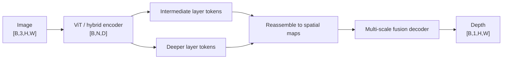

**创新点：** DPT 把 Transformer token 的 global context 重新 reassemble 成多尺度 feature maps，再用 dense prediction decoder 恢复 spatial output；MiDaS 路线强调跨数据集训练与 relative depth 泛化。

---

## 2. Depth Anything V2

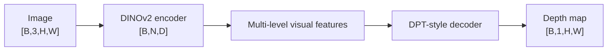

**创新点：** 强视觉 foundation encoder + 大规模 synthetic/real depth data + teacher/student-style data strategy，让 monocular depth 从专用网络转向 foundation visual representation 驱动。

维度重点仍然是：

```text
image → patch tokens [B,N,D]
→ multi-level features
→ dense map [B,1,H,W]
```

具体 `D,N` 由 backbone 与输入 resolution 决定。

---

## 3. Video Depth Anything

```text
video                     [B,T,3,H,W]
per-frame visual features [B,T,N,D]
temporal modeling/fusion  [B,T,N,D]
depth sequence            [B,T,1,H,W]
```

**创新点：** 不只逐帧调用 monocular depth；显式利用 temporal information 降低 frame-to-frame flicker，提高视频深度一致性。

---

## 4. Prompt Depth Anything

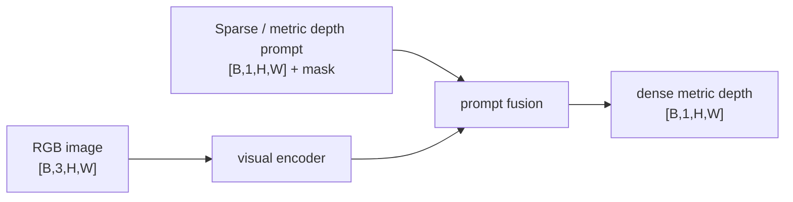

**创新点：** 用 sparse depth / metric cues 作为 prompt，将单目先验与真实尺度观测融合，解决纯 monocular depth 的绝对尺度歧义。

---

# Part B. Point Clouds

## 5. PointNet

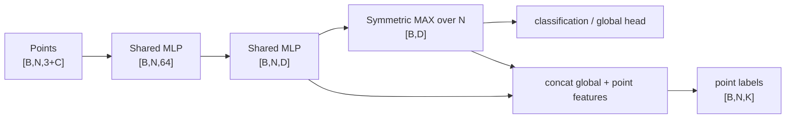

**创新点：** shared point-wise MLP + symmetric pooling 保证对 point permutation 不敏感；直接处理 unordered point set，不先体素化。

---

## 6. PointNet++

```text
[B,N,3+C]
→ sample centroids
→ group local neighborhoods
→ local PointNet
→ fewer points, larger receptive field
→ hierarchical features
```

典型抽象：

```text
N0 points [B,N0,C0]
→ N1 centers [B,N1,C1]
→ N2 centers [B,N2,C2]
→ global / feature propagation
```

**创新点：** 修复 PointNet 缺少 local geometric hierarchy 的问题，通过 sampling + grouping + local PointNet 建立多尺度邻域结构。

---

## 7. Sparse Convolution


**创新点：** 只在 occupied voxels 上计算，避免 dense 3D grid 的 `H×W×Z` 巨大浪费。

---

## 8. Point Transformer v3 (PTv3)

```text
points                    [N,3+C]
→ serialized / ordered point representation
→ point tokens            [N,D]
→ efficient point transformer blocks
→ multi-scale point features
```

**创新点：** 通过 serialization 等工程/表示设计降低传统 point attention 的 neighborhood overhead，使 Transformer 更容易扩展到大规模点云。

---

# Part C. LiDAR 3D Detection

## 9. PointPillars

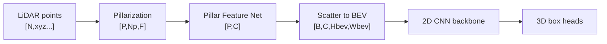

**创新点：** 把 3D point cloud 沿高度方向压成 pillars，使后续主干变成高效 2D CNN，显著提高实时性。

---

## 10. SECOND

```text
points → 3D voxels
→ sparse 3D convolution pyramid
→ compress Z to BEV
→ 2D detection head
```

```text
sparse voxel features      [Nv,C]
BEV feature                [B,Cbev,Hbev,Wbev]
box predictions            dense/sparse BEV locations × box params
```

**创新点：** 稀疏 3D convolution 直接保留 voxel geometry，比纯 pillar representation 更完整，同时避免 dense 3D conv 的高成本。

---

## 11. CenterPoint

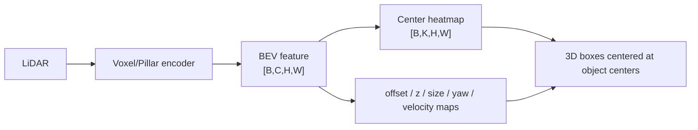

**创新点：** 3D objects 以 BEV center points 表示，anchor-free center heatmap + regression 简化 3D box detection，并自然扩展到 tracking/velocity。

---

# Part D. BEV

## 12. BEVFormer

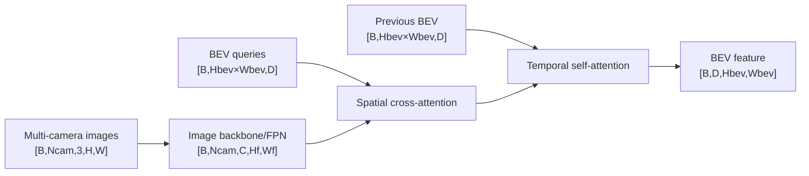

**创新点：** 用 learnable BEV queries 通过 camera geometry-aware spatial cross-attention 从多视角 image features 取信息，同时 temporal attention 融合历史 BEV。

---

## 13. BEVFusion

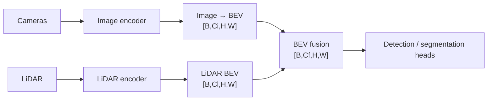

**创新点：** 先把 camera 与 LiDAR 投到共享 BEV grid，再在同一空间融合，避免 raw sensor coordinate 不一致带来的复杂 cross-modal alignment。

---

## 14. 3D Occupancy

统一输出可以记：

```text
occupancy logits           [B,K,X,Y,Z]
```

或稀疏 voxel representation。


**创新意义：** detection 只预测 objects；occupancy 试图表示完整 3D space 的 occupied/free + semantics，更适合 autonomous driving / embodied world representation。

---

# Part E. Learned Multi-view Geometry

## 15. DUSt3R

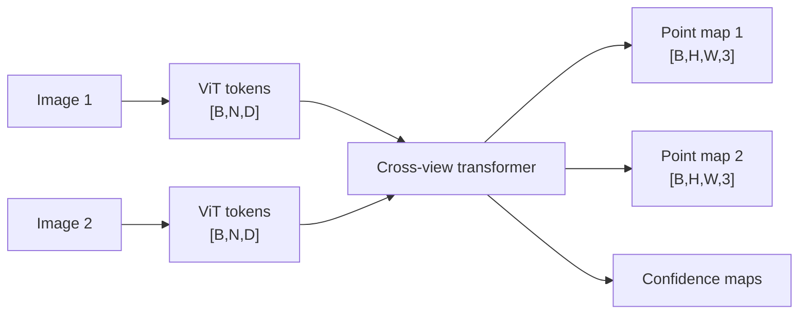

**创新点：** 将传统 `feature matching → geometry → triangulation` 的多步 SfM 前端，重写成直接预测 dense 3D point maps 的 learned geometry problem。

---

## 16. MASt3R

```text
DUSt3R-style cross-view geometry
+ dense matching descriptors
→ point maps + matching features
```

典型抽象：

```text
point map                  [B,H,W,3]
descriptor map             [B,H,W,Dm]
confidence                 [B,H,W]
```

**创新点：** 在 DUSt3R 3D reconstruction 表示上进一步强化 dense local feature matching，使 learned geometry 更容易接入 localization / mapping / multi-view matching。

---

## 17. VGGT

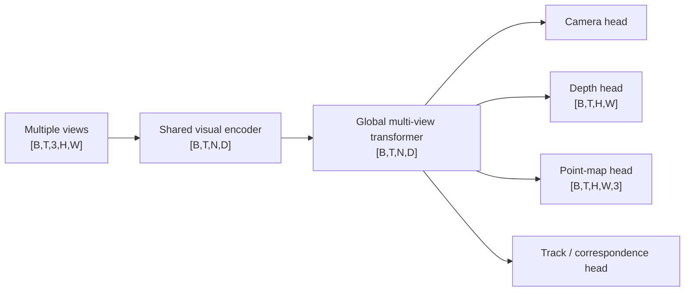

**创新点：** 以 feed-forward transformer 一次处理多视图并联合预测 camera、depth、point map、track 等 geometry outputs，进一步减少传统 SfM/BA pipeline 中大量 iterative modules。

---

## 18. VGGT-Ω

仓库现有条目给出的公开升级应这样理解：

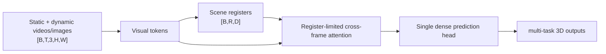

### 重点 shape

```text
frame tokens               [B,T,N,D]
scene registers            [B,R,D], R << T×N
cross-frame exchange       mainly through registers
output                     dense geometry predictions
```

### 创新点

- scene information 压入少量 registers；
- register attention 限制昂贵的全量跨帧 interaction；
- 单一 dense prediction head + multi-task supervision；
- 去掉昂贵 high-resolution convolution；
- 更大规模 unlabeled video self-supervision；
- 支持 dynamic scenes 并降低 training memory。

**一句话：** `VGGT-Ω = 用 scene registers 做跨帧信息瓶颈，让 3D foundation model 更容易扩到动态视频与更大数据。`

---

# Part F. Neural Scene Representation

## 19. NeRF

每条 camera ray 上采样 `Nr` 个 3D points：

```text
positions                  [B,Nr,3]
view directions            [B,Nr,3]
MLP → density              [B,Nr,1]
MLP → RGB                  [B,Nr,3]
volume rendering → pixel   [B,3]
```

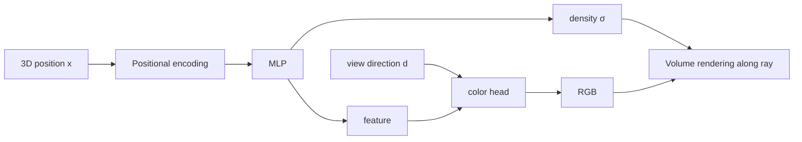

**创新点：** 用 continuous neural field 表示 scene，而不是显式 mesh/voxel；通过 differentiable volume rendering 从 posed images 学 3D radiance field。

---

## 20. 3D Gaussian Splatting

每个 Gaussian primitive 可抽象为：

```text
position μ                 [N,3]
scale                      [N,3]
rotation                   [N,4] quaternion or equivalent
opacity                    [N,1]
color / SH coefficients    [N,Csh]
```

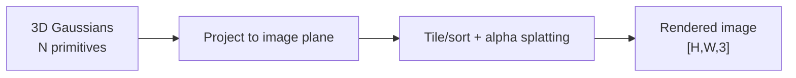

**创新点：** 从 implicit MLP field 转向 explicit learnable Gaussian primitives；通过 differentiable splatting 实现高质量且远快于经典 NeRF ray-marching 的 rendering。

---

# Part G. SLAM / VIO：系统图，不是假装一个网络

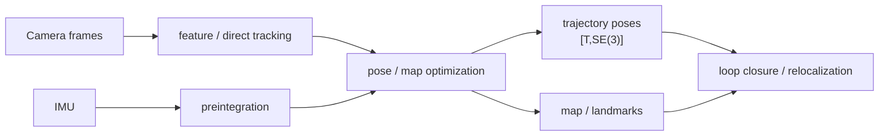

**关键区分：** SLAM/VIO 是 estimation system；某些模块可以是 learned feature/depth/network，但 Bundle Adjustment、state estimation、loop closure 等不等价于一个单一 neural architecture。

---

# 最终一张表

| Model | 主表示 | 典型输出 | 最重要创新 |
|---|---|---|---|
| DPT/MiDaS | ViT tokens → spatial maps | `[B,1,H,W]` | Transformer dense prediction |
| Depth Anything V2 | DINOv2 tokens | depth | foundation encoder + large depth data |
| PointNet | `[B,N,C]` | global / point labels | permutation-invariant set network |
| PointNet++ | hierarchical points | multi-scale point features | local grouping hierarchy |
| SparseConv | active voxels `[Nv,C]` | voxel/BEV feature | compute only occupied voxels |
| PTv3 | point tokens `[N,D]` | point features | scalable serialized point transformer |
| PointPillars | pillars → BEV | 3D boxes | 3D → efficient 2D BEV CNN |
| SECOND | sparse voxels → BEV | 3D boxes | sparse 3D conv |
| CenterPoint | BEV | center heatmap + box params | anchor-free 3D centers |
| BEVFormer | camera features + BEV queries | BEV grid | spatial + temporal attention |
| BEVFusion | camera BEV + LiDAR BEV | fused BEV | shared-coordinate fusion |
| DUSt3R | image-pair tokens | point maps | learned feed-forward geometry |
| MASt3R | geometry + descriptors | point maps + matches | geometry + dense matching |
| VGGT | multi-view tokens | camera/depth/points/tracks | joint feed-forward 3D foundation |
| VGGT-Ω | frame tokens + registers | multi-task dense 3D | register bottleneck + dynamic scenes |
| NeRF | sampled 3D points | RGB/density → render | implicit radiance field |
| 3DGS | explicit Gaussians | rendered image | fast differentiable splatting |

## 记忆口诀

```text
Depth：token 最后一定还原成 dense map
PointNet：逐点 MLP + max
SparseConv：只算有点的 voxel
PointPillars：3D 压成 BEV
CenterPoint：物体就是中心点
BEVFormer：BEV query 去看多相机
BEVFusion：先对齐 BEV 再融合
DUSt3R：图像对直接出 point map
MASt3R：再加 matching descriptor
VGGT：多视图一次出多种 geometry
VGGT-Ω：跨帧信息压进 registers
NeRF：MLP 场 + ray rendering
3DGS：显式 Gaussian + splatting
```
