# Generative Models & World Models — Architecture + Tensor Dimensions

> 原 README 的生成模型理论保持不变。本页只补 **结构图、tensor flow 与创新点**。

# Part A. Autoencoder / VAE / VQ-VAE

## 1. Autoencoder

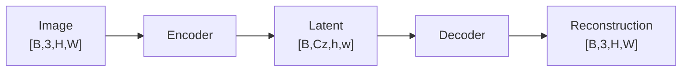

**创新点/作用：** 把高维像素压到更小 latent；生成模型后续常在 latent 而不是原始像素上计算。

---

## 2. VAE

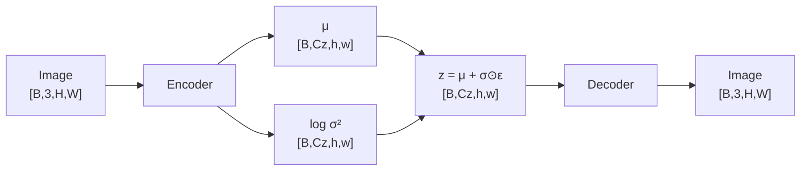

**创新点：** latent 不是一个确定向量，而是可采样 distribution；reparameterization 允许随机采样路径反向传播，KL term 让 latent space 更平滑。

---

## 3. VQ-VAE

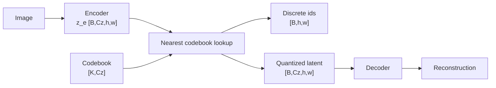

### 维度

```text
continuous encoder latent   [B,Cz,h,w]
codebook                    [K,Cz]
discrete image token ids    [B,h,w]
flatten image-token seq     [B,N], N=h×w
```

**创新点：** 把连续视觉 latent 变成有限 codebook indices，因此 image generation 可以转成类似 LLM 的 discrete-token modeling。

---

# Part B. Diffusion

## 4. DDPM：输入和预测 shape 相同

训练时：

```text
clean x0                    [B,C,H,W]
noise ε                     [B,C,H,W]
noisy x_t                   [B,C,H,W]
time step t                 [B]
model prediction ε_hat      [B,C,H,W]
```

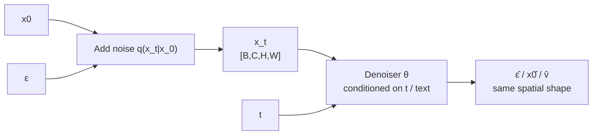

**创新点：** 固定 forward noising，学习 reverse denoising；训练可以通过随机采一个 `t` 完成，而推理从纯噪声反复走多个 reverse steps。

---

## 5. DDIM

基础 denoiser shape 与 DDPM 不变：

```text
x_t → model → prediction     [B,C,H,W]
```

**真正变化：** sampling trajectory。DDIM 允许更少 steps / deterministic-style path，因此“版本差异”不是 backbone tensor 变了，而是 reverse solver/transition 变了。

---

## 6. Latent Diffusion

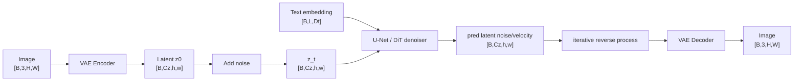

**创新点：** 把最昂贵的 denoising 从像素 `H×W` 移到更小 latent `h×w`，同时保留文本 cross-attention/conditioning。

口诀：`先 VAE 压，再 diffusion，最后 VAE 解。`

---

# Part C. U-Net / DiT / MMDiT

## 7. Diffusion U-Net

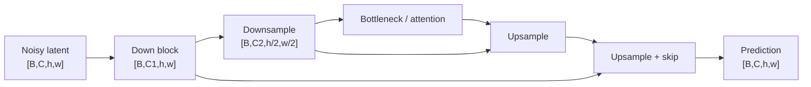

额外条件：

```text
time embedding              [B,D]
text tokens                 [B,L,Dt]
```

通过 adaptive norm、cross-attention 等注入各 block。

**创新点：** 多尺度 down/up + skip connection 同时保留结构和细节，非常适合 dense denoising。

---

## 8. DiT

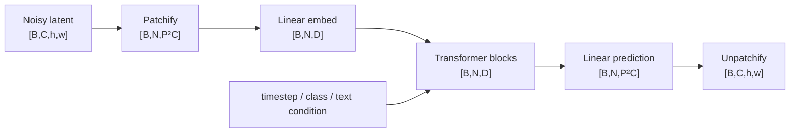

**创新点：** 用 scalable Transformer 取代 diffusion U-Net 的主要 backbone，把生成模型也带入 token + Transformer 的 scaling 路线。

---

## 9. MMDiT

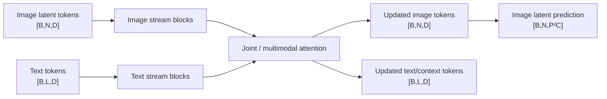

**创新点：** 文本和图像 latent 不只是“文本给图像做一个静态 condition”，而是在 Transformer 内部进行更深的双流/联合交互。

口诀：`DiT = 一条 latent token 流；MMDiT = text/image 两种 token 深度联合。`

---

# Part D. Flow Matching / Rectified Flow

## 10. Flow Matching

```text
x_t                       [B,C,h,w] or [B,N,D]
time t                    [B]
condition c                text/image/action tokens
vector field vθ(x_t,t,c)  same shape as x_t
```

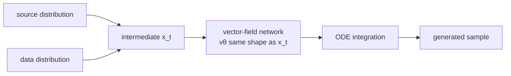

**创新点：** 直接学习连续时间 transport vector field；与 diffusion 一样是 noise→data，但训练目标和 sampling equation 的表达更接近连续流。

---

## 11. Rectified Flow

网络 input/output shape 与 Flow Matching 相同。

**真正变化：** 希望把 transport trajectory 学得更直，从而让较少 ODE steps 也能接近目标分布。不要把“Rectified Flow”误背成一个固定 backbone 名。

---

# Part E. Discrete Image Generation

## 12. Autoregressive image tokens

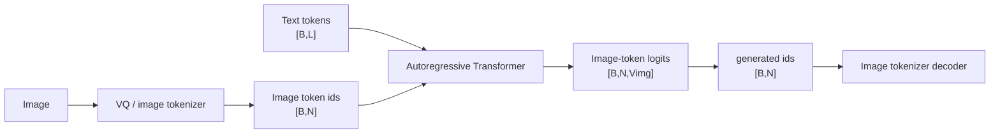

**创新点：** 视觉生成被完全转换成 next-token prediction，与 LLM 接口天然统一；主要成本变成长视觉 token sequence 的 autoregressive decode。

---

## 13. Masked image generation

```text
image-token sequence       [B,N]
masked positions           [B,N] boolean mask
parallel logits            [B,N,Vimg]
```

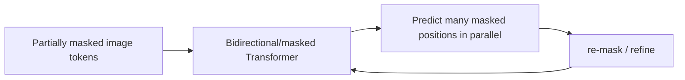

**创新点：** 不必严格左到右，一个 iteration 可并行填多个位置；用 iterative refinement 换取更低 decoding steps。

---

# Part F. Unified Understanding + Generation

## 14. Janus family

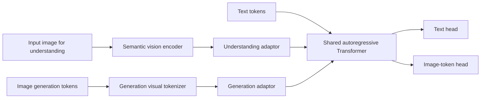

**创新点：** understanding 和 generation 共享核心 Transformer，但使用不同视觉 representation path，避免“抽象语义表示”和“高保真可重建表示”的目标冲突。

---

## 15. InternVL-U

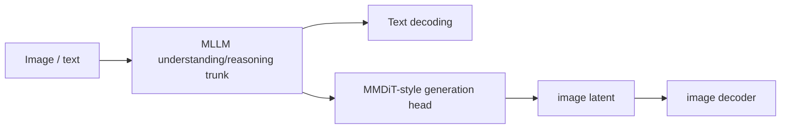

**创新点：** 把 multimodal understanding/reasoning 与 image generation/editing 放在同一系统；generation head 仍可以保持专用 continuous-latent architecture。

---

# Part G. Video / World Models

## 16. Video generation

```text
video latent                [B,T,C,h,w]
patch/token form            [B,Nvideo,D]
Nvideo ∝ T × h × w / patch_volume
predicted latent            same shape as input latent
```

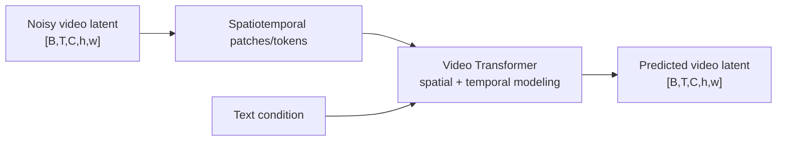

**创新点：** 相比 image generation，多出来的核心不是简单的 `T`，而是 object identity、motion、camera motion 和 temporal consistency 必须共同建模。

---

## 17. World Model

最通用的 tensor 表达：

```text
observation/state tokens     [B,T,N,D]
actions                      [B,T,A] or discrete [B,T]
future latent/state          [B,Tfuture,N,D]
```

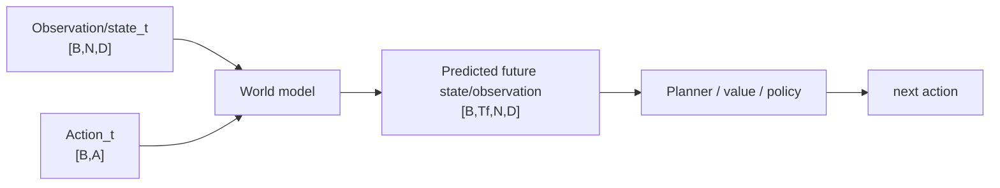

**创新点：** 普通 video generator 只要求未来“看起来合理”；world model 更强调 **conditioned on state + action** 的未来预测必须对 planning/decision 有用。

---

# 最终一张表

| Model family | 核心表示 | 网络输出 shape | 真正创新 |
|---|---|---|---|
| AE | continuous latent `[B,Cz,h,w]` | image | compression/reconstruction |
| VAE | `μ,logσ²,z` | image | probabilistic latent |
| VQ-VAE | discrete ids `[B,N]` | image | visual tokenizer/codebook |
| DDPM | noisy tensor | same-shape denoise prediction | learned reverse diffusion |
| DDIM | same as DDPM | same | faster/deterministic sampling path |
| Latent Diffusion | latent `[B,Cz,h,w]` | latent prediction | diffusion in compressed space |
| U-Net | multi-scale maps | same dense shape | down/up + skips |
| DiT | latent tokens `[B,N,D]` | latent patches | Transformer denoiser |
| MMDiT | text + image token streams | image latent | deep multimodal joint attention |
| Flow Matching | continuous state | same-shape vector field | learned continuous transport |
| AR image model | discrete `[B,N]` | `[B,N,Vimg]` | next image-token prediction |
| Masked generation | masked `[B,N]` | `[B,N,Vimg]` | parallel iterative fill |
| Janus | two visual representations | text + image tokens | decoupled understanding/generation |
| World Model | state + action | future state sequence | prediction for planning |

## 记忆口诀

```text
VAE：连续概率 latent
VQ-VAE：连续变离散 token
DDPM：加噪再学去噪
Latent Diffusion：先压缩，再扩散
U-Net：多尺度上下采样
DiT：latent patch → Transformer
MMDiT：text/image 两条流联合
Flow：学 vector field
AR image：像 LLM 一样一个 token 一个 token 生图
Janus：共享脑子，不强迫共享眼睛
World Model：state + action → future
```
