# Representative VLM / Omni Models — Architecture, Dimensions & Innovation Deltas

> 本页只补 **模型结构图、tensor 维度、版本创新点**。原 README 的模型介绍、时间线和来源保持不变。
>
> 统一原则：能公开确认的就画；官方没有公开 vision encoder / projector / layer dimensions 的，不猜内部结构。

# 0. 先背所有 MLLM 的公共 shape

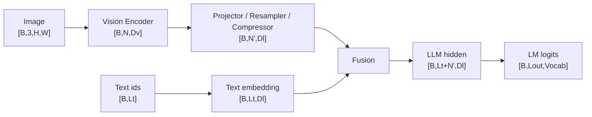

视频通常只是多一维时间：

```text
video                         [B,T,3,H,W]
visual tokens before merge    [B,T,N,Dv]
after temporal/spatial merge  [B,Nvideo,Dl]
```

面试时真正要追的是两个维度：

```text
Dv → Dl     特征维度怎么对齐？
N  → N'     视觉 token 数怎么压缩？
```

---

# Part A. 三条经典 VLM 路线

## 1. Flamingo

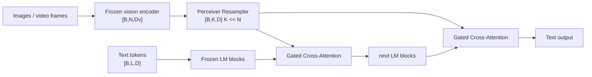

### 维度

```text
vision features              [B,N,Dv]
resampled visual memory      [B,K,D]
text hidden                  [B,L,D]
cross-attention output       [B,L,D]
```

**创新点：** 用固定数量 `K` 个 latent tokens 压缩任意数量视觉特征，并把 gated cross-attention 插入语言模型层间；视觉作为外部 memory，不必直接拼成一条长 token sequence。

---

## 2. BLIP-2

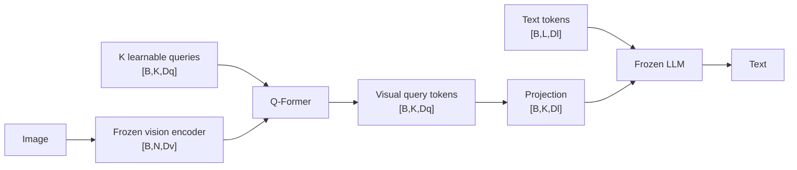

**创新点：** Q-Former 作为小型、可训练的信息瓶颈，在冻结 vision encoder 和冻结 LLM 之间完成视觉信息筛选与语言对齐。

口诀：`Flamingo 用 Resampler + cross-attn；BLIP-2 用 Q-Former bottleneck。`

---

## 3. LLaVA

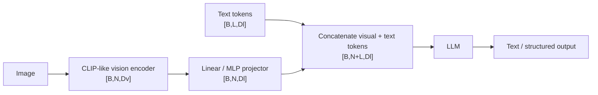

**创新点：** connector 极简，不主动引入复杂 cross-attention；强 vision backbone + instruction data + LLM 本身承担主要跨模态建模。

口诀：`LLaVA = vision encoder → MLP → 直接塞给 LLM。`

---

# Part B. Qwen-VL lineage

## 4. Qwen2.5-VL：Dynamic Resolution + M-RoPE

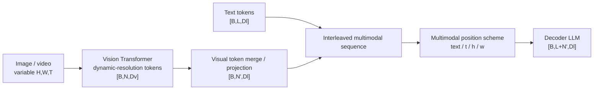

### Shape 重点

```text
N ∝ image area / patch area
video N ∝ T × spatial patches
N' < N after visual merge/compression
```

**创新点：** 不把所有图像强制缩成固定低分辨率；视觉 token 数随原图/视频内容变化，并用 multimodal positional encoding 同时表达时间和二维空间位置。

---

## 5. Qwen3-VL：在 Qwen2.5-VL 骨架上记三个差分

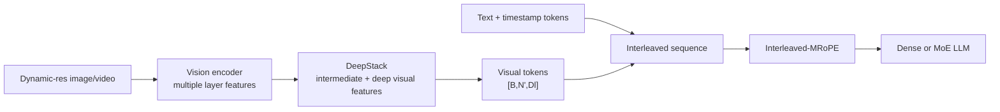

### 只记版本变化

```text
Qwen2.5-VL:
Dynamic Resolution + M-RoPE

Qwen3-VL:
+ Interleaved-MRoPE
+ DeepStack multi-layer visual features
+ text-based timestamp alignment for video
+ dense / MoE model families
```

**创新点：** 视觉层不只拿最后一层；中层的 local/spatial detail 通过 DeepStack 进入语言模型，更利于 OCR、grounding 和 fine-grained perception。

---

## 6. Qwen3.5 → Qwen3.6 → Qwen3.8

这一条必须按“公开边界”画，不能因为版本号变大就自行发明新的 vision tower。

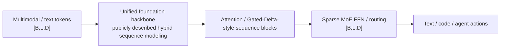

### 版本差分

```text
Qwen3.5: unified vision-language foundation + hybrid sequence backbone + sparse MoE line
Qwen3.6: built on the same foundation, emphasizes agentic coding / thinking stability
Qwen3.8: continues the Qwen3.5 architectural foundation, expands coding / research / long-horizon agent capability
```

**不要背：** “3.6/3.8 一定换了某个 vision encoder / projector”。如果对应 checkpoint model card 没公开，就标 `not publicly disclosed`。

---

# Part C. InternVL lineage

## 7. InternVL classic architecture

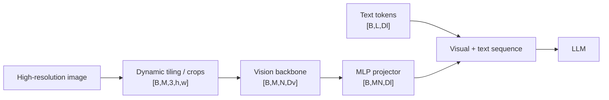

**创新点：** dynamic tiling 让高分辨率细节通过多个 tiles 进入 vision tower；代价是 visual token 数和 LLM prefill 成本随 tile 数上升。

---

## 8. InternVL3.5：ViR + DvD + Cascade RL

### 模型路径

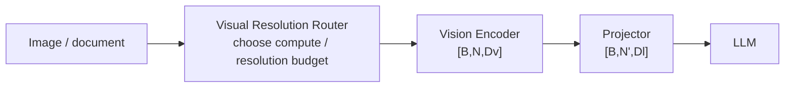

### Serving 路径

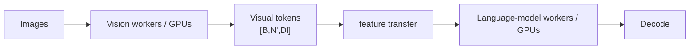

**创新点：**
- `ViR`：不是固定 resize，而是按输入/任务自适应分配视觉分辨率与 token budget；
- `DvD`：vision 与 LLM 可以解耦部署，直接把架构设计连接到 serving；
- `Cascade RL`：属于 post-training 创新，不改变基础 tensor flow，但增强 reasoning/action behavior。

---

## 9. InternVL-U：Understanding + Generation

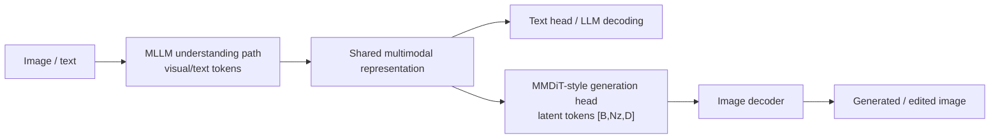

**创新点：** “统一”不意味着所有模态必须共享同一个 encoder，而是把 understanding/reasoning 与 image generation/editing 放入同一训练/表示系统。

---

# Part D. 2025–2026 representative open VLMs

## 10. Seed1.5-VL

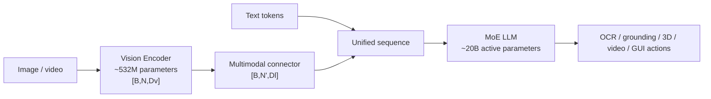

**创新点：** 强调 `data + model + training + agent` 一体化；结构上是强视觉塔 + MoE language backbone，能力覆盖从 OCR 到 3D/GUI agent。

---

## 11. Kimi-VL

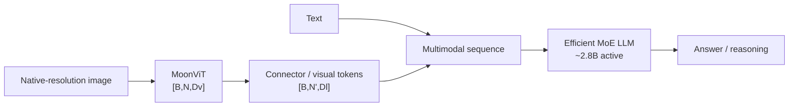

**创新点：** MoonViT 面向 native-resolution visual encoding；language side 用高效 MoE 控制 active compute。Thinking 版本主要是 long-CoT SFT + RL 的 post-training 差异，不应画成完全不同的 vision architecture。

---

## 12. MiniCPM-V 4.6

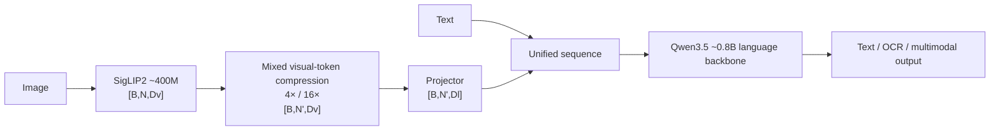

### Token 维度只记比例

```text
before compression          N visual tokens
4× compression             roughly N/4 token budget
16× compression            roughly N/16 token budget
```

具体实现不是简单固定 pooling，因此面试说“mixed compression ratio / routing”比死背每个 token 坐标更准确。

**创新点：** 把视觉 token 压缩直接作为端侧优化核心，同时降低 LLM prefill、KV memory 与延迟，而不只是量化 LLM 权重。

---

## 13. MiniCPM-o 4.5

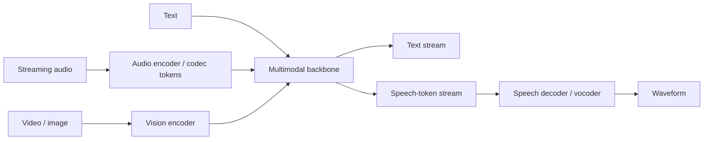

**创新点：** full-duplex 不是“多一个 TTS head”，而是输入 audio/video 与输出 speech/text 能持续并行流动；工程上需要 streaming cache、turn-taking、interruption 与同步。

---

## 14. Qwen3-Omni：Thinker–Talker

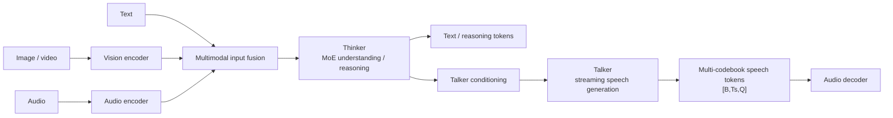

### 维度重点

```text
speech token time steps      Ts
number of codebooks          Q
codec-token ids              [B,Ts,Q]
```

**创新点：** Thinker–Talker 把 multimodal reasoning 与 streaming speech generation 分工；multi-codebook speech representation 提升声学容量，并支持实时语音输出。

---

## 15. Llama 4 multimodal MoE

公开层面可安全画到：

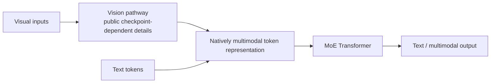

**创新点：** native multimodal training + MoE；面试必须区分 `total parameters` 和 `active parameters`。不同 Scout/Maverick checkpoint 的 context/experts/hidden 配置应按对应官方 model card 查，不统一硬背一个维度。

---

## 16. Gemma 3

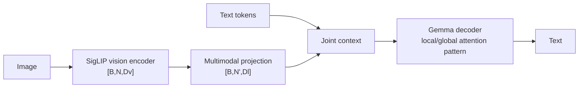

**创新点：** 轻量开放 VLM 路线；通过 local/global attention pattern 控制长上下文成本，同时保留周期性 global interaction。

---

## 17. Janus / Janus-Pro：理解和生成视觉表示解耦

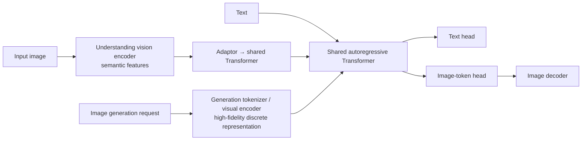

**创新点：** understanding 需要抽象语义，generation 需要可重建细节；Janus 不强迫两者共用完全相同的 visual representation，但共享核心 Transformer。

口诀：`统一 Transformer，不等于统一视觉编码器。`

---

## 18. STEP3-VL-10B

```text
image/video → vision encoder → visual tokens [B,N,Dv]
text        → text embeddings [B,L,Dl]
visual projection / fusion
→ multimodal Transformer / LLM
→ answer / reasoning
```

**创新点：** fully-unfrozen multimodal pretraining 强调 vision + language 共同适配；大规模 RL 提升 reasoning；PaCoRe 属于 test-time perceptual reasoning / inference-time compute，不应误画成一个固定的新 backbone block。

---

# Part E. Native multimodal agents

## 19. GLM-V / GLM-5V-Turbo

公开能力可以这样画：

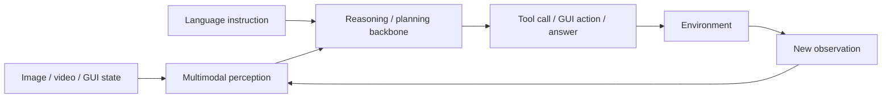

**创新点：** native multimodal agent 强调 perception 直接进入 reasoning/planning/tool execution 闭环，而不是先 caption 成文本再交给独立 agent。

**维度原则：** 如果官方 report/model card 没公开具体 `Dv/Dl/layers/vision projector`，就明确写 `not publicly disclosed`，不从产品能力反推网络细节。

---

# Part F. 闭源模型：只画公开接口

GPT / Gemini / Claude 等若内部 vision encoder、projector、hidden size、training mixture 未公开：

```mermaid
flowchart LR
    U["Public multimodal inputs"] --> M["Proprietary multimodal model\ninternal architecture not publicly disclosed"]
    M --> O["Public outputs / tools"]
```

**面试加分点：** 能力公开 ≠ 架构公开。不要用 LLaVA/Qwen 的开源结构替闭源模型“脑补”内部实现。

---

# 一张表背完代表性 VLM

| Model | Visual → LLM bridge | Token strategy | 真正创新点 |
|---|---|---|---|
| Flamingo | Perceiver Resampler + gated cross-attn | `N → K` fixed latents | visual memory + cross-attention |
| BLIP-2 | Q-Former | `N → K` learnable queries | frozen towers + trainable bottleneck |
| LLaVA | MLP projector | usually keeps many visual tokens | simple connector + instruction tuning |
| Qwen2.5-VL | dynamic-res visual path | dynamic `N`, merge to `N'` | Dynamic Resolution + M-RoPE |
| Qwen3-VL | DeepStack + visual merge | dynamic `N'` | Interleaved-MRoPE + DeepStack + timestamp |
| InternVL | dynamic tiling + MLP | tiles increase token budget | high-resolution perception |
| InternVL3.5 | ViR + projector | adaptive visual budget | resolution routing + DvD serving |
| Seed1.5-VL | connector → MoE LLM | symbolic | 532M vision + 20B-active MoE |
| Kimi-VL | MoonViT → connector | native-resolution | MoonViT + efficient MoE |
| MiniCPM-V 4.6 | compression + projector | mixed 4×/16× | edge visual-token compression |
| Qwen3-Omni | multimodal fusion → Thinker/Talker | text + audio codebooks | omni reasoning + streaming speech |
| Gemma 3 | SigLIP → projector | model-dependent | lightweight VLM + local/global attention |
| Janus-Pro | separate understand/generate visual paths | semantic vs reconstructive tokens | decoupled visual representations |

## 最终记忆口诀

```text
Flamingo：视觉当 memory
BLIP-2：Q-Former 压成 K 个 query
LLaVA：MLP 直接接 LLM
Qwen-VL：动态分辨率 + 多模态位置
Qwen3-VL：再加 DeepStack + timestamp
InternVL：切高分图；3.5 再加 resolution router
MiniCPM：先压 visual tokens 再谈端侧
Omni：Thinker 负责想，Talker 负责说
Janus：理解和生成别硬共享视觉表示
闭源：不知道就明确说不知道
```
