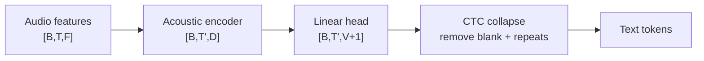
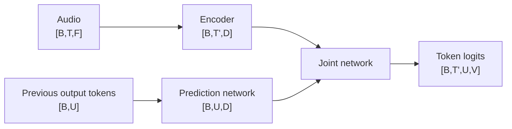
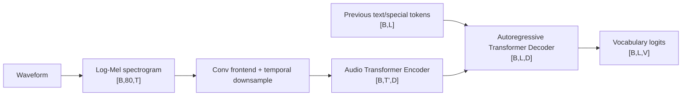
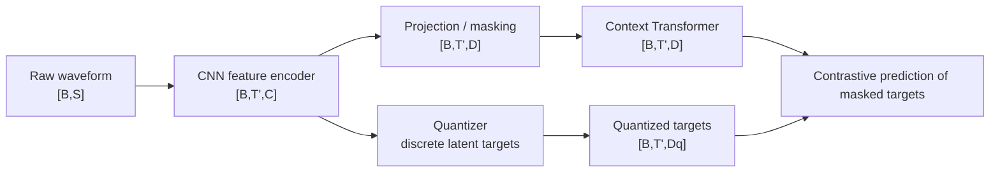
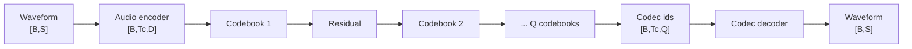
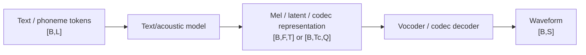
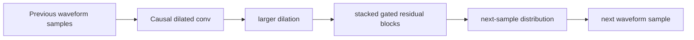
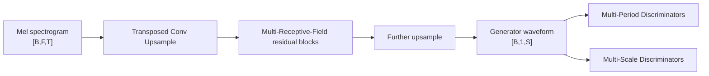
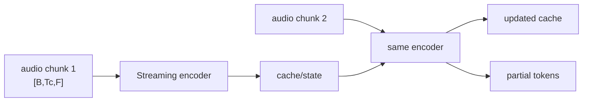
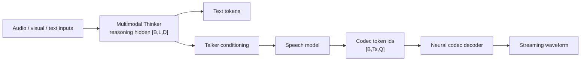

# Speech / Audio Models — Architecture + Tensor Dimensions

> 原 README 的音频概念与系统知识保持不变。本页只补 **模型结构、shape flow 与创新点**。

# 0. 语音输入 shape 先统一

```text
waveform                    [B,S]
STFT / spectrogram          [B,F,T]
Mel spectrogram             [B,Fmel,T]
audio encoder hidden        [B,T',D]
text-token logits           [B,T' or L,V]
codec token ids             [B,Tc,Q]
```

其中：

- `S`：waveform samples；
- `T/T'`：声学帧数；
- `F/Fmel`：频率 bins；
- `Q`：codec codebooks 数量。

---

# Part A. CTC / Transducer

## 1. CTC ASR



### Shape

```text
encoder output             [B,T',D]
per-frame logits           [B,T',V+1]
+1                         blank symbol
```

**创新点/作用：** 不需要 frame-level character alignment；对所有与目标文本一致的 blank/repeat alignment path 求和。

口诀：`每帧先猜字符/blank → 去 blank → 合并重复。`

---

## 2. RNN-T / Transducer



**创新点：** 同时建模 acoustic time `T'` 与 output history `U`；比 CTC 的条件独立假设更弱，并天然适合 streaming ASR。

维度记忆：

```text
CTC:   [B,T',V]
RNN-T: [B,T',U,V]
```

---

# Part B. Whisper

## 3. Whisper Encoder–Decoder Transformer



### 维度主线

```text
log-Mel                   [B,80,T]
audio hidden              [B,T',D]
decoder hidden            [B,L,D]
text logits               [B,L,V]
```

**创新点：** 大规模弱监督 + encoder-decoder Transformer，把 transcription、translation、language ID、timestamps 等统一成 token prediction，而不是为每个语音任务单独训练 head。

---

# Part C. wav2vec 2.0

## 4. wav2vec 2.0 Pretraining



### Fine-tuning ASR

```text
waveform
→ feature CNN
→ Transformer              [B,T',D]
→ CTC head                 [B,T',V+1]
```

**创新点：** 先从大量未标注 raw speech 学 contextual representations，再用较少标注文本 fine-tune；masked latent prediction 把 NLP 的 self-supervised 思路引入 speech。

---

# Part D. Neural Audio Codec / RVQ

## 5. Neural Codec



### RVQ shape

```text
encoder latent             [B,Tc,D]
codebook ids               [B,Tc,Q]
Q                          number of residual codebooks
```

**创新点：** Residual Vector Quantization 每个 codebook 编码上一步剩余误差；增加 codebooks 可以增加 bitrate/音质，但 speech generation 需要同时管理多个 token streams。

这也是 Omni 模型里 `multi-codebook speech generation` 的底层背景。

---

# Part E. TTS / Vocoder

## 6. 通用现代 TTS 链路



现代 speech-to-speech 模型也可以跳过显式 Mel，直接生成 codec tokens。

---

## 7. WaveNet



### Shape

```text
waveform context           [B,1,T]
hidden feature             [B,C,T]
next-sample logits         [B,T,Vaudio]  (quantized formulation)
```

**创新点：** causal dilated convolution 在不使用 RNN 的情况下快速扩大 temporal receptive field，并自回归建模 raw waveform；音质高但逐 sample 生成慢。

---

## 8. HiFi-GAN



**创新点：** GAN vocoder 通过 multi-period discriminator 显式捕捉语音周期结构，再配 multi-scale discriminator 建模不同时间尺度；相比自回归 WaveNet 可并行生成 waveform，推理速度更高。

口诀：`WaveNet 一点一点生；HiFi-GAN 一次并行生。`

---

# Part F. Streaming ASR

## 9. Chunk-based streaming encoder



### Shape 逻辑

```text
current chunk              [B,Tc,F]
left-context cache         [B,Tcache,D] or architecture-specific KV/state
new hidden                 [B,Tc',D]
partial logits             [B,Tc',V]
```

**创新意义：** offline model 可看完整未来上下文；streaming model 必须把未来依赖换成有限 look-ahead + reusable cache/state，在 accuracy 和 latency 间权衡。

---

# Part G. Omni speech path

## 10. Thinker–Talker / speech-token generation 的公共结构



**创新点：** 语言 reasoning token rate 和 audio codec token rate 完全不同，因此不能简单“一一对应”；Talker/codec path 负责把低频 semantic reasoning 映射到高频、多 codebook speech representation。

---

# 一张表背完

| Model / family | 输入 | 核心 hidden | 输出 | 最重要创新 |
|---|---|---|---|---|
| CTC ASR | acoustic frames | `[B,T',D]` | `[B,T',V+1]` | alignment-free blank/repeat collapse |
| RNN-T | audio + history tokens | audio `[B,T',D]`, label `[B,U,D]` | `[B,T',U,V]` | streaming transducer |
| Whisper | log-Mel + text prefix | encoder `[B,T',D]` | `[B,L,V]` | multitask seq2seq weak supervision |
| wav2vec 2.0 | raw waveform | `[B,T',D]` | contextual features / CTC | self-supervised speech representation |
| Neural codec | waveform | `[B,Tc,D]` | ids `[B,Tc,Q]` | residual multi-codebook quantization |
| WaveNet | previous samples | causal temporal features | next sample | dilated autoregressive waveform model |
| HiFi-GAN | Mel | upsampled convolution features | waveform | fast adversarial vocoder |
| Streaming encoder | chunks + cache | chunk hidden + state | partial tokens | incremental low-latency inference |

## 最终记忆口诀

```text
CTC：按帧猜，再折叠
RNN-T：声音时间 × 文本历史
Whisper：音频 Encoder + 文本 Decoder
wav2vec2：先用无标签声音学表示
Codec：声音压成多组离散 token
WaveNet：因果扩张卷积、自回归
HiFi-GAN：GAN vocoder、并行出波形
Streaming：chunk + cache，不能偷看未来
```
